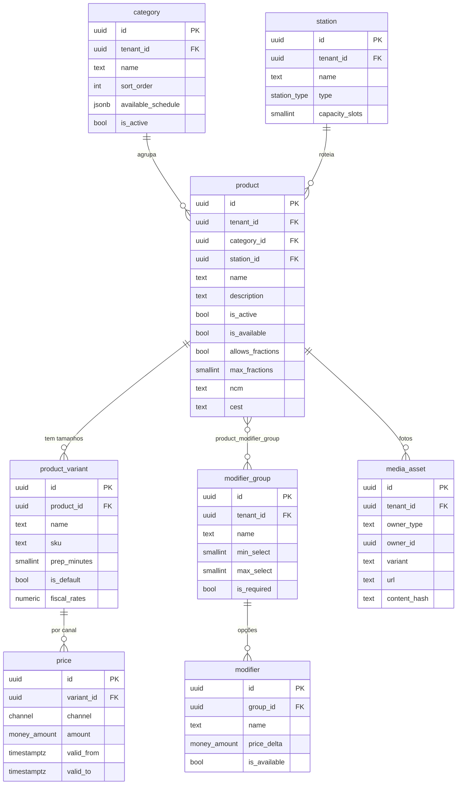

# 02 — Catálogo

| | |
|---|---|
| **Ordem de execução** | 3 de 12 |
| **Depende de** | `01-Plataforma-e-Identidade.md` |
| **ADRs** | [028](../ADRs/ADR-028-cache-e-invalidacao-catalogo.md), [030](../ADRs/ADR-030-armazenamento-de-midia.md), [017](../ADRs/ADR-017-representacao-monetaria.md) |

---

## ERD



---

## DDL

### station

Praça de produção. O tipo `OVEN` marca o recurso-gargalo (ADR do processo, doc. Otimização §3).

```sql
CREATE TABLE station (
  id             UUID PRIMARY KEY,
  tenant_id      UUID NOT NULL REFERENCES tenant(id),
  store_id       UUID NOT NULL REFERENCES store(id),
  name           TEXT NOT NULL,
  type           station_type NOT NULL DEFAULT 'ASSEMBLY',
  capacity_slots SMALLINT,                  -- posições simultâneas (forno)
  avg_cook_seconds INT,                     -- tempo médio de ocupação
  sort_order     SMALLINT NOT NULL DEFAULT 0,
  is_active      BOOLEAN NOT NULL DEFAULT true,
  created_at     TIMESTAMPTZ NOT NULL DEFAULT now(),
  updated_at     TIMESTAMPTZ NOT NULL DEFAULT now(),
  deleted_at     TIMESTAMPTZ,

  CONSTRAINT ck_station_capacity CHECK (capacity_slots IS NULL OR capacity_slots > 0)
);

-- FK pendente do documento 01
ALTER TABLE device ADD CONSTRAINT fk_device_station
  FOREIGN KEY (station_id) REFERENCES station(id);
```

### category

```sql
CREATE TABLE category (
  id                 UUID PRIMARY KEY,
  tenant_id          UUID NOT NULL REFERENCES tenant(id),
  name               TEXT NOT NULL,
  description        TEXT,
  sort_order         SMALLINT NOT NULL DEFAULT 0,
  available_schedule JSONB,                 -- {"mon":[["18:00","23:59"]], ...}
  is_active          BOOLEAN NOT NULL DEFAULT true,
  created_at         TIMESTAMPTZ NOT NULL DEFAULT now(),
  updated_at         TIMESTAMPTZ NOT NULL DEFAULT now(),
  deleted_at         TIMESTAMPTZ
);

CREATE INDEX idx_category_tenant_sort ON category (tenant_id, sort_order)
  WHERE deleted_at IS NULL AND is_active;
```

### product

```sql
CREATE TABLE product (
  id               UUID PRIMARY KEY,
  tenant_id        UUID NOT NULL REFERENCES tenant(id),
  category_id      UUID NOT NULL REFERENCES category(id),
  station_id       UUID REFERENCES station(id),
  name             TEXT NOT NULL,
  description      TEXT,
  ingredients_text TEXT,                    -- descrição para o cliente
  allergens        TEXT[],
  sort_order       SMALLINT NOT NULL DEFAULT 0,

  is_active        BOOLEAN NOT NULL DEFAULT true,
  is_available     BOOLEAN NOT NULL DEFAULT true,   -- ruptura (RF-CAT-07)
  unavailable_reason TEXT,
  unavailable_since  TIMESTAMPTZ,

  -- meio a meio (RF-CAT-04)
  allows_fractions BOOLEAN  NOT NULL DEFAULT false,
  max_fractions    SMALLINT NOT NULL DEFAULT 1,
  fraction_group   TEXT,                    -- só combina com produtos do mesmo grupo

  -- fiscal, opcional até ADR-025 ser resolvido
  ncm              VARCHAR(10),
  cest             VARCHAR(10),
  cfop             VARCHAR(5),
  origin_code      SMALLINT,

  created_at       TIMESTAMPTZ NOT NULL DEFAULT now(),
  updated_at       TIMESTAMPTZ NOT NULL DEFAULT now(),
  deleted_at       TIMESTAMPTZ,

  CONSTRAINT ck_product_fractions
    CHECK ((allows_fractions AND max_fractions BETWEEN 2 AND 4)
        OR (NOT allows_fractions AND max_fractions = 1))
);

CREATE INDEX idx_product_tenant_category ON product (tenant_id, category_id, sort_order)
  WHERE deleted_at IS NULL AND is_active;

CREATE INDEX idx_product_unavailable ON product (tenant_id)
  WHERE NOT is_available AND deleted_at IS NULL;

CREATE INDEX idx_product_name_trgm ON product USING gin (name gin_trgm_ops);
```

> `fraction_group` impede combinar meia pizza com meio hambúrguer. Produtos só se combinam dentro do mesmo grupo e mesmo tamanho.

### product_variant

```sql
CREATE TABLE product_variant (
  id            UUID PRIMARY KEY,
  tenant_id     UUID NOT NULL REFERENCES tenant(id),
  product_id    UUID NOT NULL REFERENCES product(id) ON DELETE CASCADE,
  name          TEXT NOT NULL,              -- 'Grande', 'Broto'
  sku           VARCHAR(40),
  size_code     VARCHAR(16),                -- chave de compatibilidade do meio a meio
  prep_minutes  SMALLINT NOT NULL DEFAULT 10,
  is_default    BOOLEAN NOT NULL DEFAULT false,
  is_active     BOOLEAN NOT NULL DEFAULT true,
  fiscal_rates  JSONB,                      -- CST/CSOSN, alíquotas (ADR-025)
  created_at    TIMESTAMPTZ NOT NULL DEFAULT now(),
  updated_at    TIMESTAMPTZ NOT NULL DEFAULT now(),
  deleted_at    TIMESTAMPTZ,

  CONSTRAINT ck_variant_prep CHECK (prep_minutes > 0)
);

CREATE UNIQUE INDEX uq_variant_sku ON product_variant (tenant_id, sku)
  WHERE sku IS NOT NULL AND deleted_at IS NULL;

CREATE UNIQUE INDEX uq_variant_default ON product_variant (product_id)
  WHERE is_default AND deleted_at IS NULL;

CREATE INDEX idx_variant_product ON product_variant (tenant_id, product_id)
  WHERE deleted_at IS NULL AND is_active;
```

> `size_code` é o que permite validar meio a meio: só combinam variações com o mesmo `size_code` e produtos do mesmo `fraction_group`.

### price

```sql
CREATE TABLE price (
  id          UUID PRIMARY KEY,
  tenant_id   UUID NOT NULL REFERENCES tenant(id),
  variant_id  UUID NOT NULL REFERENCES product_variant(id) ON DELETE CASCADE,
  channel     channel NOT NULL,
  amount      money_amount NOT NULL,
  valid_from  TIMESTAMPTZ NOT NULL DEFAULT now(),
  valid_to    TIMESTAMPTZ,
  created_at  TIMESTAMPTZ NOT NULL DEFAULT now(),
  created_by  UUID,

  CONSTRAINT ck_price_positive CHECK (amount >= 0),
  CONSTRAINT ck_price_period   CHECK (valid_to IS NULL OR valid_to > valid_from)
);

-- um preço vigente por variação e canal
CREATE UNIQUE INDEX uq_price_current ON price (variant_id, channel)
  WHERE valid_to IS NULL;

CREATE INDEX idx_price_lookup ON price (tenant_id, variant_id, channel, valid_from DESC);
```

> Preço é **historicizado**: alteração fecha o registro anterior (`valid_to`) e cria outro. Isso permite recalcular a margem de um pedido antigo com o preço que valia na época.

### modifier_group, modifier, product_modifier_group

```sql
CREATE TABLE modifier_group (
  id          UUID PRIMARY KEY,
  tenant_id   UUID NOT NULL REFERENCES tenant(id),
  name        TEXT NOT NULL,               -- 'Borda', 'Remover ingrediente'
  min_select  SMALLINT NOT NULL DEFAULT 0,
  max_select  SMALLINT NOT NULL DEFAULT 1,
  is_required BOOLEAN  NOT NULL DEFAULT false,
  sort_order  SMALLINT NOT NULL DEFAULT 0,
  created_at  TIMESTAMPTZ NOT NULL DEFAULT now(),
  updated_at  TIMESTAMPTZ NOT NULL DEFAULT now(),
  deleted_at  TIMESTAMPTZ,

  CONSTRAINT ck_modifier_group_select
    CHECK (min_select >= 0 AND max_select >= min_select)
);

CREATE TABLE modifier (
  id           UUID PRIMARY KEY,
  tenant_id    UUID NOT NULL REFERENCES tenant(id),
  group_id     UUID NOT NULL REFERENCES modifier_group(id) ON DELETE CASCADE,
  name         TEXT NOT NULL,
  price_delta  money_amount NOT NULL DEFAULT 0,
  ingredient_id UUID,                       -- FK adicionada no doc. 05
  quantity     qty_amount,                  -- consumo de insumo do adicional
  is_available BOOLEAN NOT NULL DEFAULT true,
  sort_order   SMALLINT NOT NULL DEFAULT 0,
  created_at   TIMESTAMPTZ NOT NULL DEFAULT now(),
  updated_at   TIMESTAMPTZ NOT NULL DEFAULT now(),
  deleted_at   TIMESTAMPTZ
);

CREATE TABLE product_modifier_group (
  product_id  UUID NOT NULL REFERENCES product(id) ON DELETE CASCADE,
  group_id    UUID NOT NULL REFERENCES modifier_group(id) ON DELETE CASCADE,
  tenant_id   UUID NOT NULL REFERENCES tenant(id),
  sort_order  SMALLINT NOT NULL DEFAULT 0,
  PRIMARY KEY (product_id, group_id)
);
```

> `modifier.ingredient_id` e `quantity` permitem que borda recheada baixe catupiry do estoque — sem isso, o CMV ignora os adicionais, que em pizzaria são relevantes.

### media_asset

```sql
CREATE TABLE media_asset (
  id           UUID PRIMARY KEY,
  tenant_id    UUID NOT NULL REFERENCES tenant(id),
  owner_type   VARCHAR(32) NOT NULL,        -- 'product' | 'branding'
  owner_id     UUID,
  variant      VARCHAR(16) NOT NULL,        -- original | large | medium | thumb | blur
  url          TEXT NOT NULL,
  content_hash VARCHAR(64) NOT NULL,        -- ADR-030
  width        INT,
  height       INT,
  bytes        INT,
  mime_type    VARCHAR(64),
  blur_data    TEXT,                        -- placeholder base64
  created_at   TIMESTAMPTZ NOT NULL DEFAULT now(),

  CONSTRAINT uq_media UNIQUE (tenant_id, owner_type, owner_id, variant, content_hash)
);

CREATE INDEX idx_media_owner ON media_asset (tenant_id, owner_type, owner_id);
```

---

## Regras de integridade

| # | Regra | Onde |
|---|---|---|
| 1 | Produto com frações tem entre 2 e 4 | `ck_product_fractions` |
| 2 | Meio a meio só combina mesmo `fraction_group` e mesmo `size_code` | Aplicação (`packages/domain`) |
| 3 | Um preço vigente por variação e canal | `uq_price_current` |
| 4 | Uma variação padrão por produto | `uq_variant_default` |
| 5 | `max_select >= min_select` | `ck_modifier_group_select` |
| 6 | Alterar catálogo incrementa `catalog_version` | Trigger (documento 11) |
| 7 | Alterar disponibilidade **não** incrementa `catalog_version` | ADR-028 |
