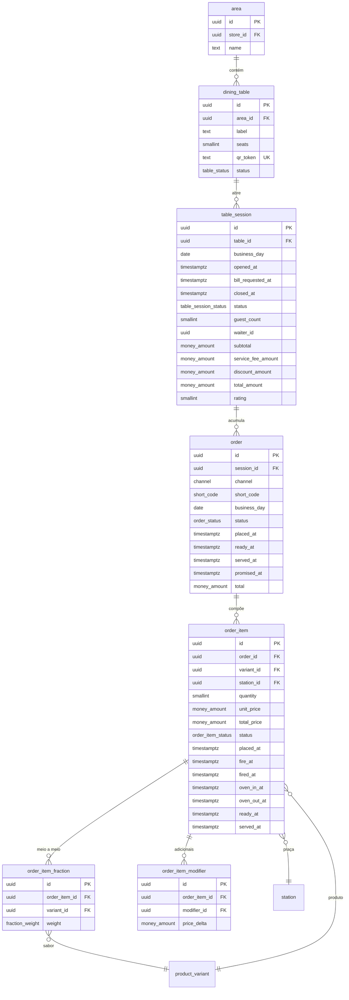

# 03 — Operação (núcleo)

| | |
|---|---|
| **Ordem de execução** | 4 de 12 |
| **Depende de** | `02-Catalogo.md` |
| **ADRs** | [016](../ADRs/ADR-016-identificadores-e-codigos.md), [018](../ADRs/ADR-018-fuso-horario-e-dia-operacional.md), [034](../ADRs/ADR-034-relogio-e-sequencia.md) |

> Este é o coração do sistema. É aqui que nasce a métrica de tempo — os carimbos T0 a T5 — que responde ao *"quantos minutos minha pizza tá sendo feita"*.

---

## ERD



---

## DDL

### area e dining_table

```sql
CREATE TABLE area (
  id         UUID PRIMARY KEY,
  tenant_id  UUID NOT NULL REFERENCES tenant(id),
  store_id   UUID NOT NULL REFERENCES store(id),
  name       TEXT NOT NULL,                -- 'Salão', 'Varanda'
  sort_order SMALLINT NOT NULL DEFAULT 0,
  is_active  BOOLEAN NOT NULL DEFAULT true,
  created_at TIMESTAMPTZ NOT NULL DEFAULT now(),
  updated_at TIMESTAMPTZ NOT NULL DEFAULT now(),
  deleted_at TIMESTAMPTZ
);

CREATE TABLE dining_table (
  id         UUID PRIMARY KEY,
  tenant_id  UUID NOT NULL REFERENCES tenant(id),
  store_id   UUID NOT NULL REFERENCES store(id),
  area_id    UUID NOT NULL REFERENCES area(id),
  label      VARCHAR(16) NOT NULL,         -- '12', 'V3'
  seats      SMALLINT NOT NULL DEFAULT 4,
  qr_token   TEXT NOT NULL,                -- token do QR Code
  status     table_status NOT NULL DEFAULT 'FREE',
  sort_order SMALLINT NOT NULL DEFAULT 0,
  is_active  BOOLEAN NOT NULL DEFAULT true,
  created_at TIMESTAMPTZ NOT NULL DEFAULT now(),
  updated_at TIMESTAMPTZ NOT NULL DEFAULT now(),
  deleted_at TIMESTAMPTZ,

  CONSTRAINT uq_table_label UNIQUE (store_id, label),
  CONSTRAINT uq_table_qr    UNIQUE (qr_token)
);

CREATE INDEX idx_table_store_status ON dining_table (tenant_id, store_id, status)
  WHERE deleted_at IS NULL AND is_active;
```

### table_session

```sql
CREATE TABLE table_session (
  id                 UUID PRIMARY KEY,
  tenant_id          UUID NOT NULL REFERENCES tenant(id),
  store_id           UUID NOT NULL REFERENCES store(id),
  table_id           UUID NOT NULL REFERENCES dining_table(id),
  business_day       DATE NOT NULL,                       -- ADR-018
  status             table_session_status NOT NULL DEFAULT 'OPEN',
  guest_count        SMALLINT NOT NULL DEFAULT 1,
  waiter_id          UUID REFERENCES app_user(id),
  opened_by          UUID,
  opened_source      VARCHAR(16) NOT NULL DEFAULT 'WAITER', -- QR | WAITER

  opened_at          TIMESTAMPTZ NOT NULL,
  bill_requested_at  TIMESTAMPTZ,
  closed_at          TIMESTAMPTZ,
  released_at        TIMESTAMPTZ,                          -- mesa liberada

  subtotal           money_amount NOT NULL DEFAULT 0,
  discount_amount    money_amount NOT NULL DEFAULT 0,
  service_fee_amount money_amount NOT NULL DEFAULT 0,
  total_amount       money_amount NOT NULL DEFAULT 0,

  rating             SMALLINT,
  rating_comment     TEXT,

  created_at         TIMESTAMPTZ NOT NULL DEFAULT now(),
  updated_at         TIMESTAMPTZ NOT NULL DEFAULT now(),

  CONSTRAINT ck_session_rating CHECK (rating IS NULL OR rating BETWEEN 1 AND 5),
  CONSTRAINT ck_session_guests CHECK (guest_count > 0),
  CONSTRAINT ck_session_totals CHECK (total_amount >= 0)
);

-- uma sessão aberta por mesa
CREATE UNIQUE INDEX uq_session_open ON table_session (table_id)
  WHERE status <> 'CLOSED';

CREATE INDEX idx_session_open      ON table_session (tenant_id, store_id, status)
  WHERE status <> 'CLOSED';
CREATE INDEX idx_session_day       ON table_session (tenant_id, business_day);
CREATE INDEX idx_session_waiter    ON table_session (tenant_id, waiter_id, business_day);
```

### order

```sql
CREATE TABLE "order" (
  id             UUID PRIMARY KEY,
  tenant_id      UUID NOT NULL REFERENCES tenant(id),
  store_id       UUID NOT NULL REFERENCES store(id),
  session_id     UUID REFERENCES table_session(id),    -- NULL em delivery/balcão
  channel        channel NOT NULL,
  short_code     short_code NOT NULL,                  -- ADR-016
  business_day   DATE NOT NULL,                        -- ADR-018
  status         order_status NOT NULL DEFAULT 'DRAFT',

  customer_id    UUID,                                 -- FK no doc. 06
  address_id     UUID,
  courier_id     UUID,

  -- CARIMBOS DE TEMPO — origem de toda a métrica (ADR-034)
  placed_at      TIMESTAMPTZ,                          -- T0
  first_fired_at TIMESTAMPTZ,                          -- T1 do primeiro item
  ready_at       TIMESTAMPTZ,                          -- T4 do último item
  dispatched_at  TIMESTAMPTZ,
  served_at      TIMESTAMPTZ,                          -- T5
  closed_at      TIMESTAMPTZ,
  cancelled_at   TIMESTAMPTZ,
  promised_at    TIMESTAMPTZ,                          -- prazo prometido

  subtotal       money_amount NOT NULL DEFAULT 0,
  discount_amount money_amount NOT NULL DEFAULT 0,
  delivery_fee   money_amount NOT NULL DEFAULT 0,
  service_fee_amount money_amount NOT NULL DEFAULT 0,
  total          money_amount NOT NULL DEFAULT 0,

  notes          TEXT,
  cancel_reason  TEXT,
  cancelled_by   UUID,
  authorized_by  UUID,

  -- fiscal (ADR-025) — opcional até a pendência ser resolvida
  fiscal_status  fiscal_status NOT NULL DEFAULT 'NONE',
  fiscal_key     VARCHAR(44),
  fiscal_number  INT,
  fiscal_series  SMALLINT,
  fiscal_protocol VARCHAR(32),

  created_at     TIMESTAMPTZ NOT NULL DEFAULT now(),
  updated_at     TIMESTAMPTZ NOT NULL DEFAULT now(),
  created_by     UUID,
  device_id      UUID,

  CONSTRAINT ck_order_total    CHECK (total >= 0),
  CONSTRAINT ck_order_timeline CHECK (served_at IS NULL OR placed_at IS NULL OR served_at >= placed_at),
  CONSTRAINT ck_order_session  CHECK ((channel = 'DINE_IN') = (session_id IS NOT NULL))
);

-- código curto único por loja e dia operacional (ADR-016)
CREATE UNIQUE INDEX uq_order_short_code
  ON "order" (store_id, business_day, short_code);

-- fila operacional: índice parcial, consultado dezenas de vezes por minuto
CREATE INDEX idx_order_active ON "order" (tenant_id, store_id, status)
  WHERE status IN ('PLACED','IN_PRODUCTION','READY');

CREATE INDEX idx_order_day       ON "order" (tenant_id, business_day, channel);
CREATE INDEX idx_order_placed    ON "order" (tenant_id, placed_at DESC);
CREATE INDEX idx_order_session   ON "order" (tenant_id, session_id) WHERE session_id IS NOT NULL;
CREATE INDEX idx_order_late      ON "order" (tenant_id, promised_at)
  WHERE status IN ('PLACED','IN_PRODUCTION') AND promised_at IS NOT NULL;
```

### order_item — onde a métrica nasce

```sql
CREATE TABLE order_item (
  id            UUID PRIMARY KEY,
  tenant_id     UUID NOT NULL REFERENCES tenant(id),
  order_id      UUID NOT NULL REFERENCES "order"(id) ON DELETE CASCADE,
  variant_id    UUID NOT NULL REFERENCES product_variant(id),
  station_id    UUID REFERENCES station(id),

  quantity      SMALLINT NOT NULL DEFAULT 1,
  unit_price    money_amount NOT NULL,
  modifiers_total money_amount NOT NULL DEFAULT 0,
  total_price   money_amount NOT NULL,
  unit_cost     money_amount,                -- custo apurado na baixa (ADR-008)

  status        order_item_status NOT NULL DEFAULT 'QUEUED',
  notes         TEXT,

  -- CARIMBOS T0 a T5 (doc. 04 §4.2)
  placed_at     TIMESTAMPTZ NOT NULL,        -- T0
  fire_at       TIMESTAMPTZ,                 -- quando DEVE iniciar (fire time)
  fired_at      TIMESTAMPTZ,                 -- T1
  oven_in_at    TIMESTAMPTZ,                 -- T2
  oven_out_at   TIMESTAMPTZ,                 -- T3
  ready_at      TIMESTAMPTZ,                 -- T4
  served_at     TIMESTAMPTZ,                 -- T5

  oven_slot     SMALLINT,                    -- posição ocupada no gargalo
  priority_score INT,                        -- fila dinâmica

  cancel_reason  TEXT,
  cancelled_by   UUID,
  authorized_by  UUID,
  refire_of_id   UUID REFERENCES order_item(id),
  refire_reason  TEXT,

  fired_by      UUID,
  ready_by      UUID,
  served_by     UUID,

  created_at    TIMESTAMPTZ NOT NULL DEFAULT now(),
  updated_at    TIMESTAMPTZ NOT NULL DEFAULT now(),

  CONSTRAINT ck_item_quantity CHECK (quantity > 0),
  CONSTRAINT ck_item_prices   CHECK (unit_price >= 0 AND total_price >= 0),
  CONSTRAINT ck_item_sequence CHECK (
        (fired_at    IS NULL OR fired_at    >= placed_at)
    AND (oven_in_at  IS NULL OR fired_at    IS NOT NULL)
    AND (oven_out_at IS NULL OR oven_in_at  IS NOT NULL)
    AND (ready_at    IS NULL OR fired_at    IS NOT NULL)
    AND (served_at   IS NULL OR ready_at    IS NOT NULL)
  )
);

-- fila do KDS: o índice mais consultado do sistema
CREATE INDEX idx_item_queue ON order_item (tenant_id, station_id, status, placed_at)
  WHERE status IN ('QUEUED','FIRED','IN_OVEN','OUT_OF_OVEN');

CREATE INDEX idx_item_order  ON order_item (order_id);
CREATE INDEX idx_item_ready  ON order_item (tenant_id, ready_at)
  WHERE status = 'READY';                   -- itens parados na janela
CREATE INDEX idx_item_oven   ON order_item (tenant_id, station_id)
  WHERE status = 'IN_OVEN';                 -- ocupação do gargalo
CREATE INDEX idx_item_metrics ON order_item (tenant_id, variant_id, placed_at);
```

> `ck_item_sequence` é a garantia estrutural de que os carimbos são coerentes. Um item não pode estar pronto sem ter sido iniciado. Sem essa constraint, um bug de código produziria durações negativas — que corromperiam silenciosamente todos os indicadores.

### order_item_fraction — meio a meio

```sql
CREATE TABLE order_item_fraction (
  id            UUID PRIMARY KEY,
  tenant_id     UUID NOT NULL REFERENCES tenant(id),
  order_item_id UUID NOT NULL REFERENCES order_item(id) ON DELETE CASCADE,
  variant_id    UUID NOT NULL REFERENCES product_variant(id),
  weight        fraction_weight NOT NULL,
  unit_price    money_amount NOT NULL,      -- preço do sabor isolado
  sort_order    SMALLINT NOT NULL DEFAULT 0
);

CREATE INDEX idx_fraction_item ON order_item_fraction (order_item_id);
```

Regras aplicadas em `packages/domain`:

| # | Regra |
|---|---|
| 1 | A soma dos `weight` de um item deve ser exatamente 1 |
| 2 | Todas as frações devem ter o mesmo `size_code` |
| 3 | Todos os produtos devem pertencer ao mesmo `fraction_group` |
| 4 | O preço segue `tenant_config.operation.halfAndHalfPricing` |
| 5 | A baixa de estoque é **proporcional ao peso** (ADR-008) |

### order_item_modifier

```sql
CREATE TABLE order_item_modifier (
  id            UUID PRIMARY KEY,
  tenant_id     UUID NOT NULL REFERENCES tenant(id),
  order_item_id UUID NOT NULL REFERENCES order_item(id) ON DELETE CASCADE,
  modifier_id   UUID NOT NULL REFERENCES modifier(id),
  quantity      SMALLINT NOT NULL DEFAULT 1,
  price_delta   money_amount NOT NULL DEFAULT 0,
  name_snapshot TEXT NOT NULL               -- preserva o nome à época do pedido
);

CREATE INDEX idx_item_modifier ON order_item_modifier (order_item_id);
```

> `name_snapshot` existe para que o comprovante de um pedido antigo continue correto mesmo que o modificador seja renomeado depois.

---

## Métricas derivadas destes carimbos

| Métrica | Cálculo |
|---|---|
| Tempo de fila | `fired_at − placed_at` |
| Tempo de montagem | `oven_in_at − fired_at` |
| Tempo de cocção | `oven_out_at − oven_in_at` |
| Tempo de finalização | `ready_at − oven_out_at` |
| Tempo de expedição | `served_at − ready_at` |
| **Tempo total** | `served_at − placed_at` |
| Aderência ao prazo | `served_at <= promised_at` |
| Sincronização de mesa | `max(ready_at) − min(ready_at)` por pedido |
| Ocupação do gargalo | Contagem de itens em `IN_OVEN` ÷ `station.capacity_slots` |
