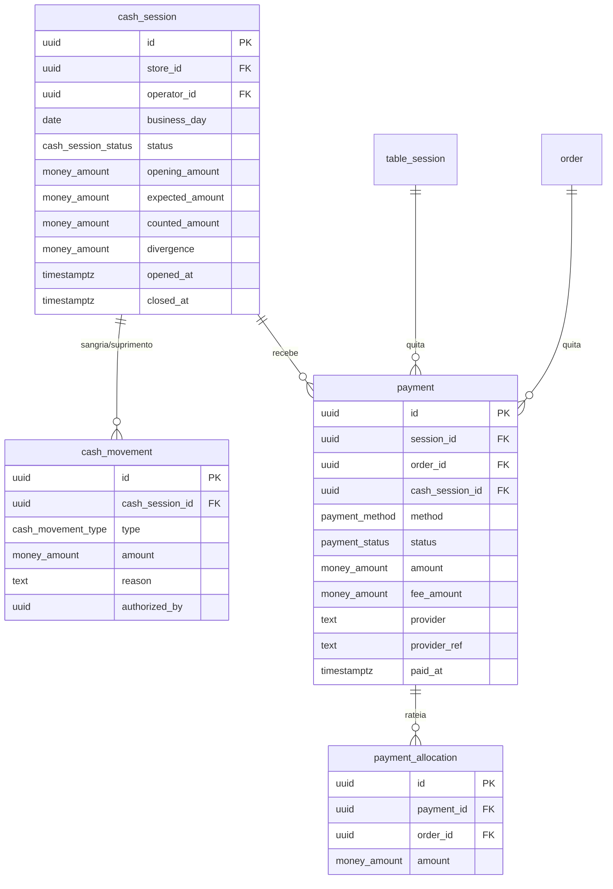

# 04 — Caixa e pagamento

| | |
|---|---|
| **Ordem de execução** | 5 de 12 |
| **Depende de** | `03-Operacao.md` |
| **ADRs** | [017](../ADRs/ADR-017-representacao-monetaria.md), [024](../ADRs/ADR-024-abstracao-de-pagamento.md), [023](../ADRs/ADR-023-modelo-de-autorizacao.md) |

---

## ERD



---

## DDL

### cash_session

```sql
CREATE TABLE cash_session (
  id              UUID PRIMARY KEY,
  tenant_id       UUID NOT NULL REFERENCES tenant(id),
  store_id        UUID NOT NULL REFERENCES store(id),
  operator_id     UUID NOT NULL REFERENCES app_user(id),
  device_id       UUID REFERENCES device(id),
  business_day    DATE NOT NULL,                        -- ADR-018

  status          cash_session_status NOT NULL DEFAULT 'OPEN',

  opening_amount  money_amount NOT NULL DEFAULT 0,
  expected_amount money_amount,                          -- calculado no fechamento
  counted_amount  money_amount,                          -- informado pelo operador
  divergence      money_amount,                          -- counted − expected

  opened_at       TIMESTAMPTZ NOT NULL,
  closed_at       TIMESTAMPTZ,
  closed_by       UUID,
  authorized_by   UUID,                                  -- se divergência acima do limite
  justification   TEXT,

  created_at      TIMESTAMPTZ NOT NULL DEFAULT now(),
  updated_at      TIMESTAMPTZ NOT NULL DEFAULT now(),

  CONSTRAINT ck_cash_opening CHECK (opening_amount >= 0),
  CONSTRAINT ck_cash_closed  CHECK (
    status <> 'CLOSED' OR (closed_at IS NOT NULL AND counted_amount IS NOT NULL)
  )
);

-- um caixa aberto por operador e loja
CREATE UNIQUE INDEX uq_cash_open ON cash_session (store_id, operator_id)
  WHERE status <> 'CLOSED';

CREATE INDEX idx_cash_day ON cash_session (tenant_id, business_day);
CREATE INDEX idx_cash_divergent ON cash_session (tenant_id, business_day)
  WHERE divergence IS NOT NULL AND divergence <> 0;
```

### cash_movement

```sql
CREATE TABLE cash_movement (
  id              UUID PRIMARY KEY,
  tenant_id       UUID NOT NULL REFERENCES tenant(id),
  cash_session_id UUID NOT NULL REFERENCES cash_session(id) ON DELETE CASCADE,
  type            cash_movement_type NOT NULL,
  amount          money_amount NOT NULL,
  reason          TEXT NOT NULL,
  created_by      UUID NOT NULL,
  authorized_by   UUID,
  occurred_at     TIMESTAMPTZ NOT NULL,
  created_at      TIMESTAMPTZ NOT NULL DEFAULT now(),

  CONSTRAINT ck_movement_amount CHECK (amount > 0)
);

CREATE INDEX idx_cash_movement ON cash_movement (cash_session_id, occurred_at);
```

> O valor é sempre positivo; o `type` define o sinal na apuração. Isso evita o erro clássico de sangria registrada como valor positivo somando no caixa.

### payment

```sql
CREATE TABLE payment (
  id              UUID PRIMARY KEY,
  tenant_id       UUID NOT NULL REFERENCES tenant(id),
  store_id        UUID NOT NULL REFERENCES store(id),
  session_id      UUID REFERENCES table_session(id),
  order_id        UUID REFERENCES "order"(id),
  cash_session_id UUID REFERENCES cash_session(id),
  business_day    DATE NOT NULL,

  method          payment_method NOT NULL,
  status          payment_status NOT NULL DEFAULT 'PENDING',
  amount          money_amount NOT NULL,
  fee_amount      money_amount NOT NULL DEFAULT 0,      -- taxa do adquirente (RF-FIN-10)
  net_amount      money_amount GENERATED ALWAYS AS (amount - fee_amount) STORED,
  tip_amount      money_amount NOT NULL DEFAULT 0,
  change_amount   money_amount NOT NULL DEFAULT 0,      -- troco

  provider        VARCHAR(32),                          -- ADR-024
  provider_ref    TEXT,                                 -- NSU, id da transação
  provider_payload JSONB,
  installments    SMALLINT NOT NULL DEFAULT 1,
  card_brand      VARCHAR(20),
  authorization_code VARCHAR(32),

  paid_at         TIMESTAMPTZ,
  refunded_at     TIMESTAMPTZ,
  refund_amount   money_amount,
  refund_reason   TEXT,
  authorized_by   UUID,

  created_at      TIMESTAMPTZ NOT NULL DEFAULT now(),
  updated_at      TIMESTAMPTZ NOT NULL DEFAULT now(),
  created_by      UUID,

  CONSTRAINT ck_payment_amount CHECK (amount > 0),
  CONSTRAINT ck_payment_fee    CHECK (fee_amount >= 0 AND fee_amount <= amount),
  CONSTRAINT ck_payment_target CHECK (session_id IS NOT NULL OR order_id IS NOT NULL)
);

-- idempotência do provedor: mesmo NSU nunca entra duas vezes (ADR-024)
CREATE UNIQUE INDEX uq_payment_provider_ref
  ON payment (tenant_id, provider, provider_ref)
  WHERE provider_ref IS NOT NULL;

CREATE INDEX idx_payment_session ON payment (tenant_id, session_id) WHERE session_id IS NOT NULL;
CREATE INDEX idx_payment_day     ON payment (tenant_id, business_day, method);
CREATE INDEX idx_payment_cash    ON payment (cash_session_id) WHERE cash_session_id IS NOT NULL;
CREATE INDEX idx_payment_pending ON payment (tenant_id, status) WHERE status = 'PENDING';
```

> `net_amount` é coluna gerada — a taxa de cartão é uma despesa que costuma ser invisível ao dono, e tê-la calculada no banco garante que nenhum relatório a esqueça.

### payment_allocation

Necessária quando um pagamento cobre vários pedidos (mesa com múltiplos pedidos) ou quando a conta é dividida.

```sql
CREATE TABLE payment_allocation (
  id         UUID PRIMARY KEY,
  tenant_id  UUID NOT NULL REFERENCES tenant(id),
  payment_id UUID NOT NULL REFERENCES payment(id) ON DELETE CASCADE,
  order_id   UUID NOT NULL REFERENCES "order"(id),
  amount     money_amount NOT NULL,

  CONSTRAINT ck_allocation_amount CHECK (amount > 0),
  CONSTRAINT uq_allocation UNIQUE (payment_id, order_id)
);

CREATE INDEX idx_allocation_order ON payment_allocation (order_id);
```

---

## Regras de integridade

| # | Regra | Onde |
|---|---|---|
| 1 | Um caixa aberto por operador e loja | `uq_cash_open` |
| 2 | Fechamento exige valor contado | `ck_cash_closed` |
| 3 | Pagamento pertence a uma sessão **ou** a um pedido | `ck_payment_target` |
| 4 | Referência do provedor é única — protege contra webhook duplicado | `uq_payment_provider_ref` |
| 5 | Taxa nunca maior que o valor | `ck_payment_fee` |
| 6 | Soma das alocações igual ao valor do pagamento | Aplicação |
| 7 | Divisão de conta soma exatamente o total | Aplicação (ADR-017) |
| 8 | Caixa não fecha com mesa aberta, salvo autorização | Aplicação (RN-018) |
| 9 | Conta não fecha com item pendente, salvo autorização | Aplicação (RN-017) |

## Apuração do fechamento

```sql
-- expected_amount de uma sessão de caixa
SELECT
    cs.opening_amount
  + COALESCE(SUM(p.amount) FILTER (WHERE p.method = 'CASH' AND p.status = 'PAID'), 0)
  - COALESCE(SUM(p.change_amount) FILTER (WHERE p.method = 'CASH'), 0)
  + COALESCE(SUM(m.amount) FILTER (WHERE m.type = 'SUPPLY'), 0)
  - COALESCE(SUM(m.amount) FILTER (WHERE m.type = 'WITHDRAWAL'), 0)
FROM cash_session cs
LEFT JOIN payment       p ON p.cash_session_id = cs.id
LEFT JOIN cash_movement m ON m.cash_session_id = cs.id
WHERE cs.id = $1
GROUP BY cs.opening_amount;
```

Apenas dinheiro entra na conferência física. Cartão e PIX são conciliados contra o provedor (ADR-024).
