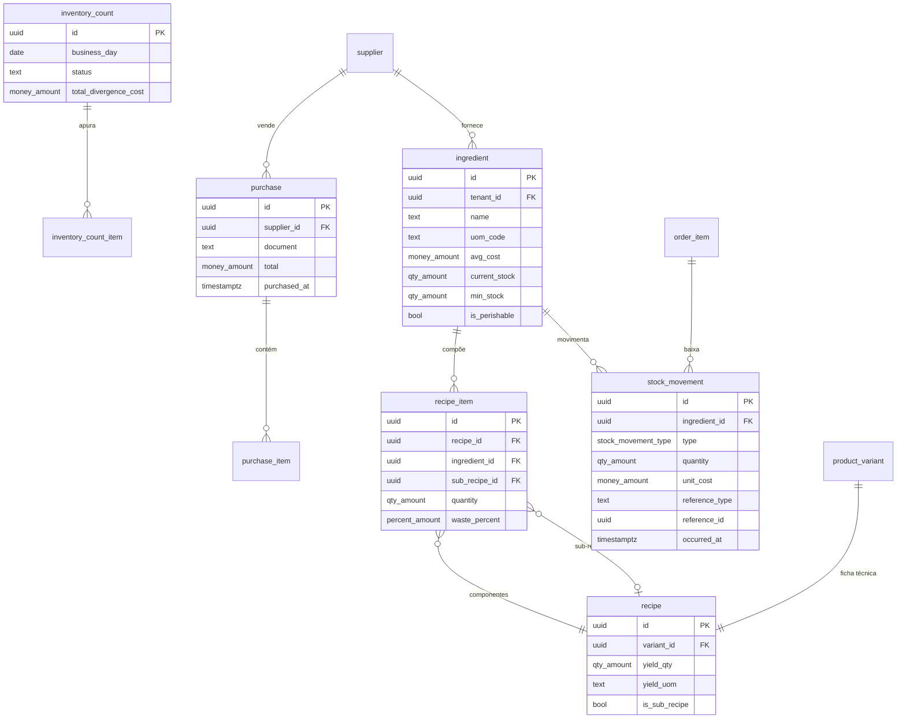

# 05 — Estoque e ficha técnica

| | |
|---|---|
| **Ordem de execução** | 6 de 12 |
| **Depende de** | `03-Operacao.md` |
| **ADRs** | [008](../ADRs/ADR-008-saldo-derivado-de-movimentos.md), [017](../ADRs/ADR-017-representacao-monetaria.md) |

> Este é o contexto de maior retorno financeiro do produto. É dele que saem CMV, custo por produto e margem — os números que respondem *"como está a saúde financeira"*.

---

## ERD



---

## DDL

### unit_of_measure (global, sem tenant)

```sql
CREATE TABLE unit_of_measure (
  code      VARCHAR(8) PRIMARY KEY,     -- KG, G, L, ML, UN, DZ
  name      TEXT NOT NULL,
  base_code VARCHAR(8),                 -- G converte para KG
  factor    NUMERIC(18,9) NOT NULL DEFAULT 1
);
```

### supplier

```sql
CREATE TABLE supplier (
  id             UUID PRIMARY KEY,
  tenant_id      UUID NOT NULL REFERENCES tenant(id),
  name           TEXT NOT NULL,
  document       VARCHAR(18),
  contact        JSONB,
  lead_time_days SMALLINT NOT NULL DEFAULT 1,
  is_active      BOOLEAN NOT NULL DEFAULT true,
  created_at     TIMESTAMPTZ NOT NULL DEFAULT now(),
  updated_at     TIMESTAMPTZ NOT NULL DEFAULT now(),
  deleted_at     TIMESTAMPTZ
);
```

### ingredient

```sql
CREATE TABLE ingredient (
  id               UUID PRIMARY KEY,
  tenant_id        UUID NOT NULL REFERENCES tenant(id),
  name             TEXT NOT NULL,
  category         VARCHAR(40),
  uom_code         VARCHAR(8) NOT NULL REFERENCES unit_of_measure(code),
  supplier_id      UUID REFERENCES supplier(id),

  -- custo médio ponderado, recalculado a cada entrada
  avg_cost         money_amount NOT NULL DEFAULT 0,
  last_cost        money_amount,

  -- MATERIALIZADO por conveniência — a verdade é stock_movement (ADR-008)
  current_stock    qty_amount NOT NULL DEFAULT 0,
  stock_synced_at  TIMESTAMPTZ,

  min_stock        qty_amount NOT NULL DEFAULT 0,
  is_perishable    BOOLEAN NOT NULL DEFAULT false,
  shelf_life_days  SMALLINT,
  is_active        BOOLEAN NOT NULL DEFAULT true,

  created_at       TIMESTAMPTZ NOT NULL DEFAULT now(),
  updated_at       TIMESTAMPTZ NOT NULL DEFAULT now(),
  deleted_at       TIMESTAMPTZ
);

CREATE INDEX idx_ingredient_low ON ingredient (tenant_id)
  WHERE current_stock <= min_stock AND deleted_at IS NULL AND is_active;

CREATE INDEX idx_ingredient_name ON ingredient USING gin (name gin_trgm_ops);

COMMENT ON COLUMN ingredient.current_stock IS
  'MATERIALIZADO. Recalculado a partir de stock_movement. Nunca escrito diretamente. (ADR-008)';

-- FK pendente do documento 02
ALTER TABLE modifier ADD CONSTRAINT fk_modifier_ingredient
  FOREIGN KEY (ingredient_id) REFERENCES ingredient(id);
```

### recipe e recipe_item

```sql
CREATE TABLE recipe (
  id            UUID PRIMARY KEY,
  tenant_id     UUID NOT NULL REFERENCES tenant(id),
  variant_id    UUID REFERENCES product_variant(id),   -- NULL em sub-receita
  name          TEXT,                                   -- 'Massa base', 'Molho'
  is_sub_recipe BOOLEAN NOT NULL DEFAULT false,
  yield_qty     qty_amount NOT NULL DEFAULT 1,
  yield_uom     VARCHAR(8) REFERENCES unit_of_measure(code),
  notes         TEXT,
  created_at    TIMESTAMPTZ NOT NULL DEFAULT now(),
  updated_at    TIMESTAMPTZ NOT NULL DEFAULT now(),
  deleted_at    TIMESTAMPTZ,

  CONSTRAINT ck_recipe_target
    CHECK ((is_sub_recipe AND variant_id IS NULL AND name IS NOT NULL)
        OR (NOT is_sub_recipe AND variant_id IS NOT NULL))
);

CREATE UNIQUE INDEX uq_recipe_variant ON recipe (variant_id)
  WHERE variant_id IS NOT NULL AND deleted_at IS NULL;

CREATE TABLE recipe_item (
  id            UUID PRIMARY KEY,
  tenant_id     UUID NOT NULL REFERENCES tenant(id),
  recipe_id     UUID NOT NULL REFERENCES recipe(id) ON DELETE CASCADE,
  ingredient_id UUID REFERENCES ingredient(id),
  sub_recipe_id UUID REFERENCES recipe(id),
  quantity      qty_amount NOT NULL,
  uom_code      VARCHAR(8) NOT NULL REFERENCES unit_of_measure(code),
  waste_percent percent_amount NOT NULL DEFAULT 0,
  sort_order    SMALLINT NOT NULL DEFAULT 0,

  CONSTRAINT ck_recipe_item_target
    CHECK ((ingredient_id IS NOT NULL) <> (sub_recipe_id IS NOT NULL)),
  CONSTRAINT ck_recipe_item_qty CHECK (quantity > 0)
);

CREATE INDEX idx_recipe_item ON recipe_item (recipe_id);
CREATE INDEX idx_recipe_item_ingredient ON recipe_item (tenant_id, ingredient_id);
```

> `waste_percent` cobre a perda natural do processo (aparas, evaporação). Ignorá-la faz o CMV teórico ficar sistematicamente abaixo do real, e a divergência vira ruído em vez de sinal.

### stock_movement — a fonte da verdade

```sql
CREATE TABLE stock_movement (
  id             UUID PRIMARY KEY,
  tenant_id      UUID NOT NULL REFERENCES tenant(id),
  store_id       UUID NOT NULL REFERENCES store(id),
  ingredient_id  UUID NOT NULL REFERENCES ingredient(id),
  business_day   DATE NOT NULL,

  type           stock_movement_type NOT NULL,
  quantity       qty_amount NOT NULL,        -- POSITIVO entra, NEGATIVO sai
  uom_code       VARCHAR(8) NOT NULL REFERENCES unit_of_measure(code),
  unit_cost      money_amount,
  total_cost     money_amount,

  reference_type VARCHAR(32),                -- 'order_item' | 'purchase' | 'inventory_count'
  reference_id   UUID,
  waste_reason   waste_reason,
  reason         TEXT,

  occurred_at    TIMESTAMPTZ NOT NULL,       -- ADR-034
  created_at     TIMESTAMPTZ NOT NULL DEFAULT now(),
  created_by     UUID,
  authorized_by  UUID,

  CONSTRAINT ck_movement_nonzero CHECK (quantity <> 0),
  CONSTRAINT ck_movement_waste   CHECK (type <> 'WASTE' OR waste_reason IS NOT NULL)
);

CREATE INDEX idx_movement_ingredient ON stock_movement (tenant_id, ingredient_id, occurred_at DESC);
CREATE INDEX idx_movement_day        ON stock_movement (tenant_id, business_day, type);
CREATE INDEX idx_movement_reference  ON stock_movement (tenant_id, reference_type, reference_id);

COMMENT ON TABLE stock_movement IS
  'Fonte da verdade do estoque. Saldo = SUM(quantity). Nunca sincronizar saldo. (ADR-008)';
```

### purchase e purchase_item

```sql
CREATE TABLE purchase (
  id           UUID PRIMARY KEY,
  tenant_id    UUID NOT NULL REFERENCES tenant(id),
  store_id     UUID NOT NULL REFERENCES store(id),
  supplier_id  UUID REFERENCES supplier(id),
  document     VARCHAR(60),                 -- número da nota
  total        money_amount NOT NULL DEFAULT 0,
  purchased_at TIMESTAMPTZ NOT NULL,
  business_day DATE NOT NULL,
  notes        TEXT,
  created_at   TIMESTAMPTZ NOT NULL DEFAULT now(),
  created_by   UUID,

  CONSTRAINT uq_purchase_document UNIQUE (tenant_id, supplier_id, document)
);

CREATE TABLE purchase_item (
  id            UUID PRIMARY KEY,
  tenant_id     UUID NOT NULL REFERENCES tenant(id),
  purchase_id   UUID NOT NULL REFERENCES purchase(id) ON DELETE CASCADE,
  ingredient_id UUID NOT NULL REFERENCES ingredient(id),
  quantity      qty_amount NOT NULL,
  uom_code      VARCHAR(8) NOT NULL REFERENCES unit_of_measure(code),
  unit_cost     money_amount NOT NULL,
  total_cost    money_amount NOT NULL,
  expires_at    DATE,
  lot_code      VARCHAR(40),

  CONSTRAINT ck_purchase_item_qty CHECK (quantity > 0)
);

CREATE INDEX idx_purchase_item ON purchase_item (purchase_id);
CREATE INDEX idx_purchase_expiry ON purchase_item (tenant_id, expires_at)
  WHERE expires_at IS NOT NULL;
```

### inventory_count — contagem cíclica

```sql
CREATE TABLE inventory_count (
  id                    UUID PRIMARY KEY,
  tenant_id             UUID NOT NULL REFERENCES tenant(id),
  store_id              UUID NOT NULL REFERENCES store(id),
  business_day          DATE NOT NULL,
  status                VARCHAR(16) NOT NULL DEFAULT 'OPEN',   -- OPEN | APPLIED | CANCELLED
  counted_at            TIMESTAMPTZ NOT NULL,
  counted_by            UUID NOT NULL,
  applied_at            TIMESTAMPTZ,
  total_divergence_cost money_amount,
  notes                 TEXT,
  created_at            TIMESTAMPTZ NOT NULL DEFAULT now()
);

CREATE TABLE inventory_count_item (
  id              UUID PRIMARY KEY,
  tenant_id       UUID NOT NULL REFERENCES tenant(id),
  count_id        UUID NOT NULL REFERENCES inventory_count(id) ON DELETE CASCADE,
  ingredient_id   UUID NOT NULL REFERENCES ingredient(id),
  expected_qty    qty_amount NOT NULL,
  counted_qty     qty_amount NOT NULL,
  divergence_qty  qty_amount GENERATED ALWAYS AS (counted_qty - expected_qty) STORED,
  unit_cost       money_amount NOT NULL,
  divergence_cost money_amount,

  CONSTRAINT uq_count_item UNIQUE (count_id, ingredient_id)
);

CREATE INDEX idx_count_item ON inventory_count_item (count_id);
```

---

## Cálculos fundamentais

### Saldo real (a verdade)

```sql
SELECT COALESCE(SUM(quantity), 0)
FROM stock_movement
WHERE tenant_id = $1 AND ingredient_id = $2;
```

### Custo de uma variação (recursivo, com sub-receitas)

```sql
WITH RECURSIVE cost AS (
  SELECT ri.recipe_id,
         ri.quantity * (1 + ri.waste_percent/100) * i.avg_cost AS amount
  FROM recipe_item ri
  JOIN ingredient i ON i.id = ri.ingredient_id
  WHERE ri.ingredient_id IS NOT NULL

  UNION ALL

  SELECT ri.recipe_id,
         ri.quantity * (1 + ri.waste_percent/100) * c.amount / NULLIF(r.yield_qty, 0)
  FROM recipe_item ri
  JOIN recipe r  ON r.id = ri.sub_recipe_id
  JOIN cost   c  ON c.recipe_id = r.id
  WHERE ri.sub_recipe_id IS NOT NULL
)
SELECT r.variant_id, ROUND(SUM(c.amount), 4) AS unit_cost
FROM cost c
JOIN recipe r ON r.id = c.recipe_id
WHERE r.variant_id = $1
GROUP BY r.variant_id;
```

### CMV teórico × real

```sql
-- teórico: soma dos custos dos itens produzidos
SELECT SUM(oi.unit_cost * oi.quantity) AS cmv_teorico
FROM order_item oi
JOIN "order" o ON o.id = oi.order_id
WHERE oi.tenant_id = $1
  AND o.business_day BETWEEN $2 AND $3
  AND oi.status IN ('READY','SERVED');

-- real: apurado pela contagem
-- estoque inicial + compras − estoque final
```

Divergência acima de `thresholds.cmvDivergencePercent` dispara alerta (RF-EST-08).

---

## Regras de integridade

| # | Regra | Onde |
|---|---|---|
| 1 | `current_stock` nunca é escrito diretamente | Aplicação + trigger (documento 11) |
| 2 | Item de receita aponta para insumo **ou** sub-receita, nunca ambos | `ck_recipe_item_target` |
| 3 | Perda exige motivo classificado | `ck_movement_waste` |
| 4 | Uma ficha técnica por variação | `uq_recipe_variant` |
| 5 | Baixa ocorre na conclusão do item (`READY`) | Aplicação (RN-007) |
| 6 | Item cancelado após iniciado gera `WASTE`, não estorno | Aplicação (RN-008) |
| 7 | Meio a meio baixa proporcional ao peso da fração | Aplicação (ADR-008) |
| 8 | Sub-receita não pode referenciar a si mesma | Aplicação (detecção de ciclo) |
