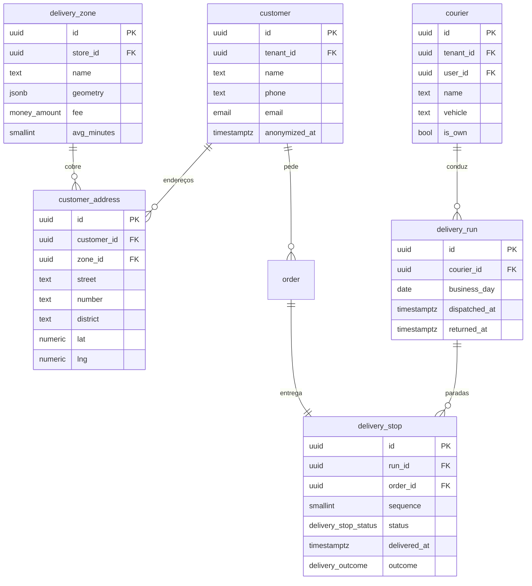

# 06 — Delivery

| | |
|---|---|
| **Ordem de execução** | 7 de 12 |
| **Depende de** | `03-Operacao.md` |
| **ADRs** | [024](../ADRs/ADR-024-abstracao-de-pagamento.md), [035](../ADRs/ADR-035-particionamento-e-retencao.md) |
| **Fase** | 4 — tabelas criadas na Fase 1 para não exigir migration pesada depois |

---

## ERD



---

## DDL

### customer

```sql
CREATE TABLE customer (
  id             UUID PRIMARY KEY,
  tenant_id      UUID NOT NULL REFERENCES tenant(id),
  name           TEXT NOT NULL,
  phone          VARCHAR(20) NOT NULL,
  email          email,
  document       VARCHAR(18),                -- CPF na nota, quando solicitado
  notes          TEXT,

  -- LGPD (RNF-LGP-05, ADR-035)
  anonymized_at  TIMESTAMPTZ,
  last_order_at  TIMESTAMPTZ,

  orders_count   INT NOT NULL DEFAULT 0,     -- materializado
  total_spent    money_amount NOT NULL DEFAULT 0,

  created_at     TIMESTAMPTZ NOT NULL DEFAULT now(),
  updated_at     TIMESTAMPTZ NOT NULL DEFAULT now(),
  deleted_at     TIMESTAMPTZ
);

CREATE UNIQUE INDEX uq_customer_phone ON customer (tenant_id, phone)
  WHERE deleted_at IS NULL AND anonymized_at IS NULL;

-- candidatos à anonimização automática
CREATE INDEX idx_customer_stale ON customer (tenant_id, last_order_at)
  WHERE anonymized_at IS NULL;
```

> `anonymized_at` marca o registro cujos dados pessoais foram removidos, preservando as métricas históricas. O `orders_count` e o `total_spent` permanecem — o vínculo com a pessoa é que desaparece.

### customer_address

```sql
CREATE TABLE customer_address (
  id           UUID PRIMARY KEY,
  tenant_id    UUID NOT NULL REFERENCES tenant(id),
  customer_id  UUID NOT NULL REFERENCES customer(id) ON DELETE CASCADE,
  zone_id      UUID,                          -- FK abaixo
  label        VARCHAR(32),                   -- 'Casa', 'Trabalho'
  street       TEXT NOT NULL,
  number       VARCHAR(16),
  complement   TEXT,
  district     TEXT,
  city         TEXT NOT NULL,
  state        CHAR(2),
  zip          VARCHAR(9),
  reference    TEXT,                          -- ponto de referência
  lat          NUMERIC(10,7),
  lng          NUMERIC(10,7),
  is_default   BOOLEAN NOT NULL DEFAULT false,
  created_at   TIMESTAMPTZ NOT NULL DEFAULT now(),
  updated_at   TIMESTAMPTZ NOT NULL DEFAULT now(),
  deleted_at   TIMESTAMPTZ
);

CREATE INDEX idx_address_customer ON customer_address (customer_id) WHERE deleted_at IS NULL;
```

### delivery_zone

```sql
CREATE TABLE delivery_zone (
  id           UUID PRIMARY KEY,
  tenant_id    UUID NOT NULL REFERENCES tenant(id),
  store_id     UUID NOT NULL REFERENCES store(id),
  name         TEXT NOT NULL,
  geometry     JSONB,                         -- GeoJSON do polígono
  districts    TEXT[],                        -- alternativa simples por bairro
  fee          money_amount NOT NULL DEFAULT 0,
  min_order    money_amount NOT NULL DEFAULT 0,
  avg_minutes  SMALLINT NOT NULL DEFAULT 20,
  max_distance_km NUMERIC(6,2),
  is_active    BOOLEAN NOT NULL DEFAULT true,
  created_at   TIMESTAMPTZ NOT NULL DEFAULT now(),
  updated_at   TIMESTAMPTZ NOT NULL DEFAULT now(),
  deleted_at   TIMESTAMPTZ
);

ALTER TABLE customer_address ADD CONSTRAINT fk_address_zone
  FOREIGN KEY (zone_id) REFERENCES delivery_zone(id);
```

> `avg_minutes` por zona alimenta o cálculo de prazo dinâmico (doc. 04 §7.3). Sem isso, prometer 25 minutos para qualquer distância é chute.

### courier

```sql
CREATE TABLE courier (
  id          UUID PRIMARY KEY,
  tenant_id   UUID NOT NULL REFERENCES tenant(id),
  store_id    UUID NOT NULL REFERENCES store(id),
  user_id     UUID REFERENCES app_user(id),   -- se acessa o app
  name        TEXT NOT NULL,
  phone       VARCHAR(20),
  vehicle     VARCHAR(20),                    -- MOTO, BIKE, CAR
  plate       VARCHAR(10),
  is_own      BOOLEAN NOT NULL DEFAULT true,  -- próprio ou terceirizado
  is_active   BOOLEAN NOT NULL DEFAULT true,
  created_at  TIMESTAMPTZ NOT NULL DEFAULT now(),
  updated_at  TIMESTAMPTZ NOT NULL DEFAULT now(),
  deleted_at  TIMESTAMPTZ
);
```

### delivery_run e delivery_stop

```sql
CREATE TABLE delivery_run (
  id             UUID PRIMARY KEY,
  tenant_id      UUID NOT NULL REFERENCES tenant(id),
  store_id       UUID NOT NULL REFERENCES store(id),
  courier_id     UUID NOT NULL REFERENCES courier(id),
  business_day   DATE NOT NULL,
  arrived_at     TIMESTAMPTZ,                 -- entregador chegou à loja
  dispatched_at  TIMESTAMPTZ,
  returned_at    TIMESTAMPTZ,
  stops_count    SMALLINT NOT NULL DEFAULT 0,
  distance_km    NUMERIC(8,2),
  created_at     TIMESTAMPTZ NOT NULL DEFAULT now()
);

CREATE INDEX idx_run_open ON delivery_run (tenant_id, store_id)
  WHERE returned_at IS NULL;

CREATE TABLE delivery_stop (
  id              UUID PRIMARY KEY,
  tenant_id       UUID NOT NULL REFERENCES tenant(id),
  run_id          UUID REFERENCES delivery_run(id),
  order_id        UUID NOT NULL REFERENCES "order"(id),
  address_id      UUID REFERENCES customer_address(id),
  sequence        SMALLINT NOT NULL DEFAULT 1,
  status          delivery_stop_status NOT NULL DEFAULT 'PENDING',
  assigned_at     TIMESTAMPTZ,
  delivered_at    TIMESTAMPTZ,
  outcome         delivery_outcome,
  outcome_reason  TEXT,
  received_by     TEXT,
  created_at      TIMESTAMPTZ NOT NULL DEFAULT now(),
  updated_at      TIMESTAMPTZ NOT NULL DEFAULT now(),

  CONSTRAINT uq_stop_order UNIQUE (order_id)
);

CREATE INDEX idx_stop_run    ON delivery_stop (run_id, sequence);
CREATE INDEX idx_stop_active ON delivery_stop (tenant_id, status)
  WHERE status IN ('PENDING','ASSIGNED','IN_TRANSIT');
```

### FKs pendentes do documento 03

```sql
ALTER TABLE "order" ADD CONSTRAINT fk_order_customer
  FOREIGN KEY (customer_id) REFERENCES customer(id);
ALTER TABLE "order" ADD CONSTRAINT fk_order_address
  FOREIGN KEY (address_id)  REFERENCES customer_address(id);
ALTER TABLE "order" ADD CONSTRAINT fk_order_courier
  FOREIGN KEY (courier_id)  REFERENCES courier(id);
```

---

## Métricas do delivery

| Métrica | Cálculo |
|---|---|
| Tempo de espera do entregador | `delivery_run.dispatched_at − arrived_at` |
| Tempo de rota | `delivery_stop.delivered_at − delivery_run.dispatched_at` |
| **Tempo total do delivery** | `delivery_stop.delivered_at − order.placed_at` |
| Entregas por rota | `delivery_run.stops_count` |
| Taxa de entrega no prazo | `delivered_at <= order.promised_at` |
| Ocorrências por motivo | Agrupamento por `outcome` |
| Custo por entrega | Custo total ÷ entregas concluídas |

> A espera do entregador na loja é custo puro e costuma ser invisível — por isso `arrived_at` existe separado de `dispatched_at`.
