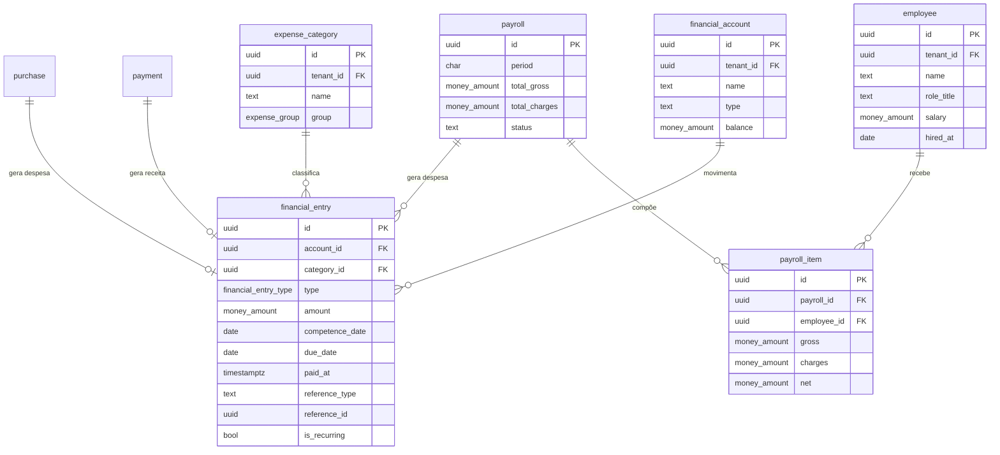

# 07 — Financeiro

| | |
|---|---|
| **Ordem de execução** | 8 de 12 |
| **Depende de** | `04-Caixa-e-Pagamento.md`, `05-Estoque-e-Ficha-Tecnica.md` |
| **ADRs** | [017](../ADRs/ADR-017-representacao-monetaria.md), [018](../ADRs/ADR-018-fuso-horario-e-dia-operacional.md) |
| **Fase** | 3 |

> Princípio deste contexto: **o financeiro não é digitado, é derivado.** Todo pagamento vira receita, toda compra vira despesa, toda folha vira despesa — automaticamente.

---

## ERD



---

## DDL

### financial_account

```sql
CREATE TABLE financial_account (
  id          UUID PRIMARY KEY,
  tenant_id   UUID NOT NULL REFERENCES tenant(id),
  name        TEXT NOT NULL,
  type        VARCHAR(20) NOT NULL,      -- CASH | BANK | ACQUIRER | OTHER
  bank_info   JSONB,
  balance     money_amount NOT NULL DEFAULT 0,   -- materializado
  is_active   BOOLEAN NOT NULL DEFAULT true,
  created_at  TIMESTAMPTZ NOT NULL DEFAULT now(),
  updated_at  TIMESTAMPTZ NOT NULL DEFAULT now(),
  deleted_at  TIMESTAMPTZ
);
```

### expense_category

```sql
CREATE TABLE expense_category (
  id          UUID PRIMARY KEY,
  tenant_id   UUID NOT NULL REFERENCES tenant(id),
  name        TEXT NOT NULL,
  "group"     expense_group NOT NULL,
  is_cmv      BOOLEAN NOT NULL DEFAULT false,   -- entra no cálculo de CMV
  is_active   BOOLEAN NOT NULL DEFAULT true,
  created_at  TIMESTAMPTZ NOT NULL DEFAULT now(),
  updated_at  TIMESTAMPTZ NOT NULL DEFAULT now(),
  deleted_at  TIMESTAMPTZ,

  CONSTRAINT uq_expense_category UNIQUE (tenant_id, name)
);
```

### financial_entry

```sql
CREATE TABLE financial_entry (
  id              UUID PRIMARY KEY,
  tenant_id       UUID NOT NULL REFERENCES tenant(id),
  store_id        UUID REFERENCES store(id),
  account_id      UUID REFERENCES financial_account(id),
  category_id     UUID REFERENCES expense_category(id),

  type            financial_entry_type NOT NULL,
  amount          money_amount NOT NULL,
  description     TEXT NOT NULL,

  competence_date DATE NOT NULL,          -- regime de competência
  due_date        DATE,
  paid_at         TIMESTAMPTZ,

  -- origem automática (o financeiro é derivado)
  reference_type  VARCHAR(32),            -- 'payment' | 'purchase' | 'payroll'
  reference_id    UUID,

  is_recurring    BOOLEAN NOT NULL DEFAULT false,
  recurrence      JSONB,                  -- {"freq":"MONTHLY","day":5,"until":"2027-12-31"}
  parent_entry_id UUID REFERENCES financial_entry(id),

  created_at      TIMESTAMPTZ NOT NULL DEFAULT now(),
  updated_at      TIMESTAMPTZ NOT NULL DEFAULT now(),
  created_by      UUID,
  deleted_at      TIMESTAMPTZ,

  CONSTRAINT ck_entry_amount CHECK (amount > 0)
);

CREATE INDEX idx_entry_competence ON financial_entry (tenant_id, competence_date, type)
  WHERE deleted_at IS NULL;
CREATE INDEX idx_entry_due        ON financial_entry (tenant_id, due_date)
  WHERE paid_at IS NULL AND deleted_at IS NULL;
CREATE INDEX idx_entry_category   ON financial_entry (tenant_id, category_id, competence_date);

-- evita lançamento duplicado a partir da mesma origem
CREATE UNIQUE INDEX uq_entry_reference
  ON financial_entry (tenant_id, reference_type, reference_id)
  WHERE reference_type IS NOT NULL AND deleted_at IS NULL;
```

> `uq_entry_reference` é o que garante que reprocessar um pagamento não gera receita em dobro — importante porque a sincronização pode reentregar eventos (ADR-007).

### employee, payroll, payroll_item

```sql
CREATE TABLE employee (
  id           UUID PRIMARY KEY,
  tenant_id    UUID NOT NULL REFERENCES tenant(id),
  store_id     UUID REFERENCES store(id),
  user_id      UUID REFERENCES app_user(id),
  name         TEXT NOT NULL,
  role_title   TEXT,
  employment   VARCHAR(20),                -- CLT | PJ | DIARISTA
  salary       money_amount NOT NULL DEFAULT 0,
  hired_at     DATE,
  terminated_at DATE,
  created_at   TIMESTAMPTZ NOT NULL DEFAULT now(),
  updated_at   TIMESTAMPTZ NOT NULL DEFAULT now(),
  deleted_at   TIMESTAMPTZ
);

CREATE TABLE payroll (
  id            UUID PRIMARY KEY,
  tenant_id     UUID NOT NULL REFERENCES tenant(id),
  store_id      UUID REFERENCES store(id),
  period        CHAR(7) NOT NULL,          -- '2026-07'
  total_gross   money_amount NOT NULL DEFAULT 0,
  total_charges money_amount NOT NULL DEFAULT 0,
  total_net     money_amount NOT NULL DEFAULT 0,
  status        VARCHAR(16) NOT NULL DEFAULT 'DRAFT',   -- DRAFT | APPROVED | PAID
  approved_by   UUID,
  paid_at       TIMESTAMPTZ,
  created_at    TIMESTAMPTZ NOT NULL DEFAULT now(),
  updated_at    TIMESTAMPTZ NOT NULL DEFAULT now(),

  CONSTRAINT uq_payroll_period UNIQUE (tenant_id, store_id, period)
);

CREATE TABLE payroll_item (
  id          UUID PRIMARY KEY,
  tenant_id   UUID NOT NULL REFERENCES tenant(id),
  payroll_id  UUID NOT NULL REFERENCES payroll(id) ON DELETE CASCADE,
  employee_id UUID NOT NULL REFERENCES employee(id),
  gross       money_amount NOT NULL DEFAULT 0,
  charges     money_amount NOT NULL DEFAULT 0,
  benefits    money_amount NOT NULL DEFAULT 0,
  deductions  money_amount NOT NULL DEFAULT 0,
  net         money_amount NOT NULL DEFAULT 0,
  notes       TEXT,

  CONSTRAINT uq_payroll_item UNIQUE (payroll_id, employee_id)
);
```

---

## Indicadores-mestre do dono

```sql
-- Prime cost e resultado do período
WITH periodo AS (SELECT $2::date AS ini, $3::date AS fim),
receita AS (
  SELECT COALESCE(SUM(amount), 0) AS total
  FROM financial_entry, periodo
  WHERE tenant_id = $1 AND type = 'REVENUE'
    AND competence_date BETWEEN ini AND fim AND deleted_at IS NULL
),
cmv AS (
  SELECT COALESCE(SUM(fe.amount), 0) AS total
  FROM financial_entry fe
  JOIN expense_category ec ON ec.id = fe.category_id, periodo
  WHERE fe.tenant_id = $1 AND ec.is_cmv
    AND fe.competence_date BETWEEN ini AND fim AND fe.deleted_at IS NULL
),
pessoal AS (
  SELECT COALESCE(SUM(fe.amount), 0) AS total
  FROM financial_entry fe
  JOIN expense_category ec ON ec.id = fe.category_id, periodo
  WHERE fe.tenant_id = $1 AND ec."group" = 'PAYROLL'
    AND fe.competence_date BETWEEN ini AND fim AND fe.deleted_at IS NULL
),
fixo AS (
  SELECT COALESCE(SUM(fe.amount), 0) AS total
  FROM financial_entry fe
  JOIN expense_category ec ON ec.id = fe.category_id, periodo
  WHERE fe.tenant_id = $1 AND ec."group" IN ('FIXED','TAX')
    AND fe.competence_date BETWEEN ini AND fim AND fe.deleted_at IS NULL
)
SELECT
  receita.total                                              AS receita,
  cmv.total                                                  AS cmv,
  ROUND(cmv.total     / NULLIF(receita.total,0) * 100, 2)    AS cmv_percent,
  pessoal.total                                              AS custo_pessoal,
  ROUND(pessoal.total / NULLIF(receita.total,0) * 100, 2)    AS pessoal_percent,
  ROUND((cmv.total + pessoal.total) / NULLIF(receita.total,0) * 100, 2) AS prime_cost_percent,
  fixo.total                                                 AS custo_fixo,
  receita.total - cmv.total - pessoal.total - fixo.total     AS resultado,
  -- ponto de equilíbrio
  ROUND(fixo.total / NULLIF(1 - (cmv.total + pessoal.total) / NULLIF(receita.total,0), 0), 2)
                                                             AS ponto_equilibrio
FROM receita, cmv, pessoal, fixo;
```

Referência de mercado: **prime cost** (CMV + pessoal) abaixo de ~65% do faturamento.

---

## Regras de integridade

| # | Regra | Onde |
|---|---|---|
| 1 | Lançamento com origem é único por referência | `uq_entry_reference` |
| 2 | Pagamento confirmado gera receita automaticamente | Aplicação |
| 3 | Compra gera despesa automaticamente | Aplicação |
| 4 | Folha aprovada gera despesa automaticamente | Aplicação |
| 5 | Valor sempre positivo; o sinal vem do `type` | `ck_entry_amount` |
| 6 | Regime de competência usa `competence_date`, não `paid_at` | Aplicação |
| 7 | Uma folha por período e loja | `uq_payroll_period` |
