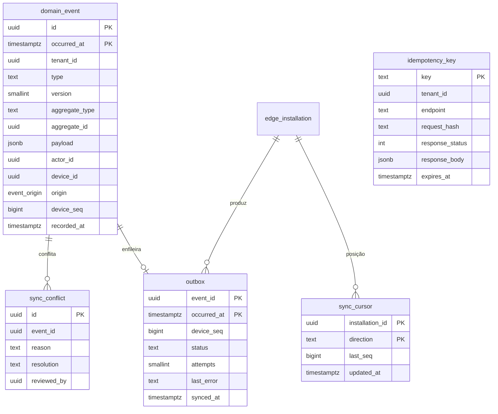

# 08 — Eventos e sincronização

| | |
|---|---|
| **Ordem de execução** | 9 de 12 |
| **Depende de** | Todos os contextos anteriores |
| **ADRs** | [006](../ADRs/ADR-006-event-sourcing-seletivo.md), [007](../ADRs/ADR-007-transactional-outbox.md), [020](../ADRs/ADR-020-idempotencia-de-escrita.md), [034](../ADRs/ADR-034-relogio-e-sequencia.md), [035](../ADRs/ADR-035-particionamento-e-retencao.md) |

> É deste contexto que saem, simultaneamente, a métrica, a auditoria e a sincronização. Se um evento não for gravado, três coisas quebram silenciosamente.

---

## ERD



---

## DDL

### domain_event — particionada por mês

```sql
CREATE TABLE domain_event (
  id             UUID NOT NULL,                    -- UUIDv7 gerado na ORIGEM (ADR-016)
  occurred_at    TIMESTAMPTZ NOT NULL,             -- horário do FATO (ADR-034)
  recorded_at    TIMESTAMPTZ NOT NULL DEFAULT now(),

  tenant_id      UUID NOT NULL,
  store_id       UUID,

  type           TEXT NOT NULL,                    -- 'order.item.fired'
  version        SMALLINT NOT NULL DEFAULT 1,
  aggregate_type TEXT NOT NULL,                    -- 'OrderItem'
  aggregate_id   UUID NOT NULL,

  payload        JSONB NOT NULL DEFAULT '{}'::jsonb,

  actor_id       UUID,
  authorized_by  UUID,
  device_id      UUID,
  origin         event_origin NOT NULL,
  device_seq     BIGINT,
  installation_id UUID,

  trace_id       VARCHAR(32),                      -- correlação (ADR-022)
  clock_suspect  BOOLEAN NOT NULL DEFAULT false,   -- desvio de relógio (ADR-034)

  PRIMARY KEY (id, occurred_at)                    -- chave de partição na PK (ADR-035)
) PARTITION BY RANGE (occurred_at);

COMMENT ON TABLE domain_event IS
  'Append-only. Fonte de métrica, auditoria e sincronização. Correção se faz com evento compensatório.';
COMMENT ON COLUMN domain_event.occurred_at IS
  'Horário do fato na origem. TODA métrica de horário usa este campo, nunca recorded_at. (RN-020)';
```

### Partições

```sql
-- criadas com antecedência pelo job mensal (ADR-035)
CREATE TABLE domain_event_2026_07 PARTITION OF domain_event
  FOR VALUES FROM ('2026-07-01') TO ('2026-08-01');
CREATE TABLE domain_event_2026_08 PARTITION OF domain_event
  FOR VALUES FROM ('2026-08-01') TO ('2026-09-01');
CREATE TABLE domain_event_2026_09 PARTITION OF domain_event
  FOR VALUES FROM ('2026-09-01') TO ('2026-10-01');
```

Função de manutenção:

```sql
CREATE OR REPLACE FUNCTION ensure_event_partitions(p_months_ahead INT DEFAULT 2)
RETURNS void LANGUAGE plpgsql AS $$
DECLARE
  d date; nome text;
BEGIN
  FOR i IN 0..p_months_ahead LOOP
    d := date_trunc('month', now())::date + (i || ' month')::interval;
    nome := 'domain_event_' || to_char(d, 'YYYY_MM');
    IF NOT EXISTS (SELECT 1 FROM pg_class WHERE relname = nome) THEN
      EXECUTE format(
        'CREATE TABLE %I PARTITION OF domain_event FOR VALUES FROM (%L) TO (%L)',
        nome, d, d + interval '1 month');
      EXECUTE format('CREATE INDEX ON %I (tenant_id, occurred_at DESC)', nome);
      EXECUTE format('CREATE INDEX ON %I (tenant_id, aggregate_type, aggregate_id)', nome);
      EXECUTE format('CREATE INDEX ON %I (tenant_id, type, occurred_at DESC)', nome);
    END IF;
  END LOOP;
END;
$$;
```

> Partição faltante causa erro de inserção — por isso duas partições futuras são sempre mantidas prontas, com alerta se faltar menos de 7 dias de folga.

### outbox

```sql
CREATE TABLE outbox (
  event_id     UUID NOT NULL,
  occurred_at  TIMESTAMPTZ NOT NULL,
  tenant_id    UUID NOT NULL,
  device_seq   BIGINT NOT NULL,
  status       VARCHAR(16) NOT NULL DEFAULT 'PENDING',   -- PENDING | SENDING | SYNCED | FAILED
  attempts     SMALLINT NOT NULL DEFAULT 0,
  last_error   TEXT,
  next_retry_at TIMESTAMPTZ,
  synced_at    TIMESTAMPTZ,
  created_at   TIMESTAMPTZ NOT NULL DEFAULT now(),

  PRIMARY KEY (event_id, occurred_at)
);

-- ordem de envio (ADR-007)
CREATE INDEX idx_outbox_pending ON outbox (device_seq)
  WHERE status IN ('PENDING','FAILED');

CREATE INDEX idx_outbox_cleanup ON outbox (synced_at)
  WHERE status = 'SYNCED';

CREATE SEQUENCE device_seq_counter;   -- monotônica por instalação (ADR-034)
```

> A tabela `outbox` existe apenas no **edge**. Na nuvem ela não é criada — a nuvem recebe, não envia operação.

### sync_cursor

```sql
CREATE TABLE sync_cursor (
  installation_id UUID NOT NULL,
  direction       VARCHAR(8) NOT NULL,      -- PUSH | PULL
  last_seq        BIGINT NOT NULL DEFAULT 0,
  last_success_at TIMESTAMPTZ,
  updated_at      TIMESTAMPTZ NOT NULL DEFAULT now(),
  PRIMARY KEY (installation_id, direction)
);
```

### sync_conflict

```sql
CREATE TABLE sync_conflict (
  id            UUID PRIMARY KEY,
  tenant_id     UUID NOT NULL REFERENCES tenant(id),
  installation_id UUID,
  event_id      UUID NOT NULL,
  event_type    TEXT NOT NULL,
  reason        TEXT NOT NULL,             -- DUPLICATE | OUT_OF_ORDER | SCHEMA_INVALID | CLOCK_SKEW
  resolution    TEXT NOT NULL,             -- KEPT_LOCAL | KEPT_REMOTE | CLAMPED | REJECTED
  payload       JSONB,
  detected_at   TIMESTAMPTZ NOT NULL DEFAULT now(),
  reviewed_by   UUID,
  reviewed_at   TIMESTAMPTZ
);

CREATE INDEX idx_conflict_pending ON sync_conflict (tenant_id, detected_at DESC)
  WHERE reviewed_at IS NULL;
```

### idempotency_key

```sql
CREATE TABLE idempotency_key (
  key             TEXT PRIMARY KEY,
  tenant_id       UUID NOT NULL,
  endpoint        TEXT NOT NULL,
  request_hash    TEXT NOT NULL,           -- detecta reuso indevido (ADR-020)
  status          VARCHAR(16) NOT NULL,    -- IN_PROGRESS | COMPLETED
  response_status INT,
  response_body   JSONB,
  created_at      TIMESTAMPTZ NOT NULL DEFAULT now(),
  expires_at      TIMESTAMPTZ NOT NULL
);

CREATE INDEX idx_idempotency_expiry ON idempotency_key (expires_at);
```

---

## Padrão de escrita transacional (ADR-006 + ADR-007)

As três operações são **atômicas**. Se a transação falhar, nada existe.

```sql
BEGIN;
  -- 1. estado
  UPDATE order_item
     SET status = 'FIRED', fired_at = $occurred_at, fired_by = $actor
   WHERE id = $item_id;

  -- 2. evento
  INSERT INTO domain_event
    (id, occurred_at, tenant_id, store_id, type, version,
     aggregate_type, aggregate_id, payload, actor_id, device_id,
     origin, device_seq, trace_id)
  VALUES
    ($event_id, $occurred_at, $tenant, $store, 'order.item.fired', 1,
     'OrderItem', $item_id, $payload, $actor, $device,
     'EDGE', nextval('device_seq_counter'), $trace);

  -- 3. fila de saída
  INSERT INTO outbox (event_id, occurred_at, tenant_id, device_seq)
  VALUES ($event_id, $occurred_at, $tenant, currval('device_seq_counter'));
COMMIT;
```

## Recepção idempotente na nuvem

```sql
INSERT INTO domain_event (id, occurred_at, ...) VALUES (...)
ON CONFLICT (id, occurred_at) DO NOTHING;
```

Reenviar o mesmo lote não duplica nada — é a garantia central do ADR-007.

---

## Consultas de integridade

Rodam diariamente. Resultado não vazio é incidente S1.

```sql
-- 1. pedido sem evento de origem
SELECT o.id, o.short_code
FROM "order" o
LEFT JOIN domain_event e
  ON e.aggregate_id = o.id AND e.type = 'order.placed'
WHERE o.status <> 'DRAFT' AND e.id IS NULL;

-- 2. outbox pendente há muito tempo
SELECT count(*) FROM outbox
WHERE status IN ('PENDING','FAILED')
  AND created_at < now() - interval '10 minutes';

-- 3. evento duplicado (não deveria existir)
SELECT id, count(*) FROM domain_event
GROUP BY id HAVING count(*) > 1;

-- 4. eventos com relógio suspeito no período
SELECT date_trunc('day', occurred_at) AS dia, count(*)
FROM domain_event
WHERE clock_suspect AND occurred_at > now() - interval '30 days'
GROUP BY 1 ORDER BY 1;

-- 5. lacuna na sequência de uma instalação
SELECT device_seq + 1 AS faltando
FROM domain_event e
WHERE installation_id = $1
  AND NOT EXISTS (
    SELECT 1 FROM domain_event n
    WHERE n.installation_id = $1 AND n.device_seq = e.device_seq + 1
  )
  AND device_seq < (SELECT max(device_seq) FROM domain_event WHERE installation_id = $1);
```

---

## Regras de integridade

| # | Regra | Onde |
|---|---|---|
| 1 | `domain_event` não aceita UPDATE nem DELETE | Trigger + grants (documento 10) |
| 2 | `id` é gerado na origem — nunca no destino | Aplicação (ADR-016) |
| 3 | `occurred_at` nunca é substituído por horário de chegada | Aplicação (RN-020) |
| 4 | Evento e estado gravados na mesma transação | Aplicação (ADR-006) |
| 5 | `device_seq` é estritamente crescente por instalação | Sequência |
| 6 | Evento fora da faixa de partição é erro, não silêncio | PostgreSQL |
| 7 | Exceção à imutabilidade: anonimização LGPD, auditada | Job específico (ADR-035) |
