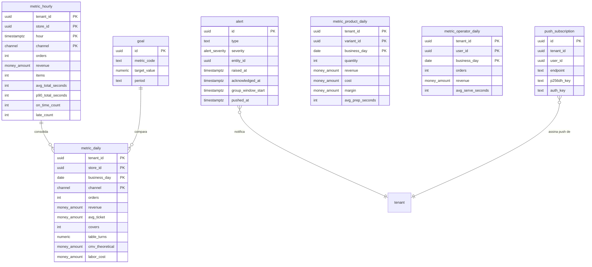

# 09 — Métricas e alertas

| | |
|---|---|
| **Ordem de execução** | 10 de 12 |
| **Depende de** | `08-Eventos-e-Sincronizacao.md` |
| **ADRs** | [012](../ADRs/ADR-012-agregados-precalculados.md), [018](../ADRs/ADR-018-fuso-horario-e-dia-operacional.md) |

> Estas tabelas são **cache descartável**. Podem ser recalculadas do zero a partir do `domain_event` a qualquer momento — o que torna seguro corrigir um bug de cálculo sem deixar cicatriz no histórico.

---

## ERD



---

## DDL

### metric_hourly

```sql
CREATE TABLE metric_hourly (
  tenant_id          UUID NOT NULL REFERENCES tenant(id),
  store_id           UUID NOT NULL REFERENCES store(id),
  hour               TIMESTAMPTZ NOT NULL,          -- truncado na hora, UTC
  business_day       DATE NOT NULL,                 -- ADR-018
  channel            channel NOT NULL,

  orders             INT NOT NULL DEFAULT 0,
  orders_cancelled   INT NOT NULL DEFAULT 0,
  items              INT NOT NULL DEFAULT 0,
  items_refired      INT NOT NULL DEFAULT 0,
  revenue            money_amount NOT NULL DEFAULT 0,

  -- tempos em segundos
  avg_queue_seconds     INT,
  avg_prep_seconds      INT,
  avg_cook_seconds      INT,
  avg_expedite_seconds  INT,
  avg_total_seconds     INT,
  p90_total_seconds     INT,
  max_total_seconds     INT,

  on_time_count      INT NOT NULL DEFAULT 0,
  late_count         INT NOT NULL DEFAULT 0,

  -- gargalo
  oven_busy_seconds  INT NOT NULL DEFAULT 0,
  oven_idle_with_queue_seconds INT NOT NULL DEFAULT 0,

  computed_at        TIMESTAMPTZ NOT NULL DEFAULT now(),

  PRIMARY KEY (tenant_id, store_id, hour, channel)
);

CREATE INDEX idx_metric_hourly_day ON metric_hourly (tenant_id, business_day);
```

> `oven_idle_with_queue_seconds` é a métrica de perda pura: gargalo livre com fila esperando. É o número que responde se vale comprar um segundo forno.

### metric_daily

```sql
CREATE TABLE metric_daily (
  tenant_id        UUID NOT NULL REFERENCES tenant(id),
  store_id         UUID NOT NULL REFERENCES store(id),
  business_day     DATE NOT NULL,
  channel          channel NOT NULL,

  orders           INT NOT NULL DEFAULT 0,
  orders_cancelled INT NOT NULL DEFAULT 0,
  items            INT NOT NULL DEFAULT 0,
  revenue          money_amount NOT NULL DEFAULT 0,
  discounts        money_amount NOT NULL DEFAULT 0,
  service_fee      money_amount NOT NULL DEFAULT 0,
  avg_ticket       money_amount NOT NULL DEFAULT 0,

  covers           INT NOT NULL DEFAULT 0,          -- pessoas atendidas
  sessions         INT NOT NULL DEFAULT 0,
  table_turns      NUMERIC(6,2),
  avg_stay_seconds INT,

  avg_total_seconds INT,
  p90_total_seconds INT,
  on_time_rate     NUMERIC(5,4),

  cmv_theoretical  money_amount NOT NULL DEFAULT 0,
  labor_cost       money_amount NOT NULL DEFAULT 0,
  card_fees        money_amount NOT NULL DEFAULT 0,

  computed_at      TIMESTAMPTZ NOT NULL DEFAULT now(),

  PRIMARY KEY (tenant_id, store_id, business_day, channel)
);
```

### metric_product_daily

Base da engenharia de cardápio (RF-BI-09).

```sql
CREATE TABLE metric_product_daily (
  tenant_id        UUID NOT NULL REFERENCES tenant(id),
  store_id         UUID NOT NULL REFERENCES store(id),
  variant_id       UUID NOT NULL REFERENCES product_variant(id),
  business_day     DATE NOT NULL,

  quantity         INT NOT NULL DEFAULT 0,
  fraction_quantity NUMERIC(10,4) NOT NULL DEFAULT 0,   -- meio a meio conta 0,5
  revenue          money_amount NOT NULL DEFAULT 0,
  cost             money_amount NOT NULL DEFAULT 0,
  margin           money_amount GENERATED ALWAYS AS (revenue - cost) STORED,
  avg_prep_seconds INT,
  cancelled        INT NOT NULL DEFAULT 0,
  refired          INT NOT NULL DEFAULT 0,

  computed_at      TIMESTAMPTZ NOT NULL DEFAULT now(),

  PRIMARY KEY (tenant_id, store_id, variant_id, business_day)
);

CREATE INDEX idx_metric_product_day ON metric_product_daily (tenant_id, business_day);
```

> `fraction_quantity` existe porque, em pizzaria, contar meio a meio como "1 unidade de cada sabor" distorce completamente a curva ABC.

### metric_operator_daily

```sql
CREATE TABLE metric_operator_daily (
  tenant_id         UUID NOT NULL REFERENCES tenant(id),
  store_id          UUID NOT NULL REFERENCES store(id),
  user_id           UUID NOT NULL REFERENCES app_user(id),
  business_day      DATE NOT NULL,
  role_context      VARCHAR(16) NOT NULL,        -- WAITER | KITCHEN | CASHIER | COURIER

  orders            INT NOT NULL DEFAULT 0,
  items             INT NOT NULL DEFAULT 0,
  revenue           money_amount NOT NULL DEFAULT 0,
  avg_ticket        money_amount NOT NULL DEFAULT 0,
  sessions          INT NOT NULL DEFAULT 0,
  avg_serve_seconds INT,
  upsell_offered    INT NOT NULL DEFAULT 0,
  upsell_accepted   INT NOT NULL DEFAULT 0,
  cancellations     INT NOT NULL DEFAULT 0,
  discounts_given   money_amount NOT NULL DEFAULT 0,

  computed_at       TIMESTAMPTZ NOT NULL DEFAULT now(),

  PRIMARY KEY (tenant_id, store_id, user_id, business_day, role_context)
);
```

> Uso desta tabela é para **treinar e dimensionar**, não punir. Ranking exposto sem contexto gera sabotagem de dado (doc. Otimização §5.4).

### goal

```sql
CREATE TABLE goal (
  id           UUID PRIMARY KEY,
  tenant_id    UUID NOT NULL REFERENCES tenant(id),
  store_id     UUID REFERENCES store(id),
  metric_code  VARCHAR(40) NOT NULL,        -- 'order_total_seconds', 'cmv_percent'
  target_value NUMERIC(14,4) NOT NULL,
  comparison   VARCHAR(8) NOT NULL DEFAULT 'LTE',   -- LTE | GTE
  period       VARCHAR(10) NOT NULL,        -- DAY | WEEK | MONTH
  valid_from   DATE NOT NULL,
  valid_to     DATE,
  created_at   TIMESTAMPTZ NOT NULL DEFAULT now(),
  created_by   UUID,

  CONSTRAINT uq_goal UNIQUE (tenant_id, store_id, metric_code, period, valid_from)
);
```

### alert

```sql
CREATE TABLE alert (
  id                 UUID PRIMARY KEY,
  tenant_id          UUID NOT NULL REFERENCES tenant(id),
  store_id           UUID REFERENCES store(id),
  type               VARCHAR(48) NOT NULL,      -- catálogo do motor (E-08/US-080 §2): ORDER_LATE,
                                                 -- AVG_TIME_ABOVE_TARGET, PRODUCT_UNAVAILABLE,
                                                 -- CASH_DIVERGENCE, SYNC_DELAY,
                                                 -- CANCELLATION_ABOVE_THRESHOLD, DISCOUNT_ABOVE_THRESHOLD
                                                 -- (+ WAITER_CALLED/BILL_REQUESTED de E-03, fora do motor)
  severity           alert_severity NOT NULL DEFAULT 'WARNING',
  entity_type        VARCHAR(32),
  entity_id          UUID,
  target_roles       TEXT[],                    -- quem deve ver (US-082, direcionamento por papel)
  target_user_id     UUID,                       -- ou por pessoa (US-082, escopo RESPONSIBLE/TABLE_OWNER)
  message            TEXT NOT NULL,
  payload            JSONB NOT NULL DEFAULT '{}'::jsonb,
  raised_at          TIMESTAMPTZ NOT NULL DEFAULT now(),
  acknowledged_at    TIMESTAMPTZ,
  acknowledged_by    UUID,
  resolved_at        TIMESTAMPTZ,
  group_key          TEXT,                      -- agrupamento anti-ruído (US-083/RF-ALT-04)
  group_window_start TIMESTAMPTZ,                -- início do bucket de agrupamento (US-083 §9)
  pushed_at          TIMESTAMPTZ                 -- entrega por Web Push já disparada (US-081 §9)
);

CREATE INDEX idx_alert_open ON alert (tenant_id, store_id, severity, raised_at DESC)
  WHERE acknowledged_at IS NULL;

CREATE INDEX idx_alert_entity ON alert (tenant_id, entity_type, entity_id);

-- US-083: agrupa instâncias abertas do MESMO tipo/janela — deliberadamente NÃO único (cada
-- instância individual, ex. um pedido atrasado por vez, precisa da própria linha para o
-- detalhamento do grupo, US-083 §7 "alerts": [ {...}, {...} ]). A garantia de "uma condição ativa
-- gera um alerta, não N" (US-080 §4, deduplicação) já é feita por código em
-- Nexora.Application.Alerts.Support.AlertRaiser, chaveada por (tenant_id, entity_type, entity_id,
-- type) — group_key é um conceito DIFERENTE (agrupamento de notificação entre entidades
-- distintas do mesmo tipo, não deduplicação da mesma entidade).
CREATE INDEX idx_alert_group ON alert (tenant_id, group_key)
  WHERE resolved_at IS NULL AND group_key IS NOT NULL;
```

### push_subscription

Assinatura de Web Push/VAPID (RFC 8291/8292) de um usuário num dispositivo — US-081 §7. Sempre
gravada e servida pela nuvem (US-081 §2 "o push é enviado pela nuvem"), mesmo quando o navegador
assinante está operando contra o edge.

```sql
CREATE TABLE push_subscription (
  id            UUID PRIMARY KEY,
  tenant_id     UUID NOT NULL REFERENCES tenant(id),
  user_id       UUID NOT NULL REFERENCES app_user(id),
  endpoint      TEXT NOT NULL,
  p256dh_key    TEXT NOT NULL,
  auth_key      TEXT NOT NULL,
  created_at    TIMESTAMPTZ NOT NULL DEFAULT now(),
  last_seen_at  TIMESTAMPTZ,
  deleted_at    TIMESTAMPTZ,

  CONSTRAINT uq_push_subscription_endpoint UNIQUE (tenant_id, endpoint)
);

CREATE INDEX idx_push_subscription_user ON push_subscription (tenant_id, user_id);
```

RLS: mesma política `tenant_isolation` de toda tabela de negócio com `tenant_id` (Docs/Domain/10
§2) — aplicada numa migration própria (`AddAlertEngineAndPushSupport`), já que a tabela nasceu
depois da migration original que habilitou RLS em massa.

> A matriz de direcionamento por tipo de alerta (US-082 §7, `GET/PATCH /v1/tenant/alert-routing`) e
> a janela de agrupamento por tipo (US-083 §7, `groupWindowSeconds`) **não ganharam coluna própria**
> em `tenant_config` — vivem aninhadas dentro da seção `operation` já existente (chave
> `alertRouting`), porque `operation` já flui pelo bootstrap/pull do edge (US-063); uma coluna nova
> exigiria estender `TenantConfig.ApplyBootstrap` e os dois pontos que a chamam
> (`ImportBootstrapCommandHandler`, `ProvisionTenantCommandHandler`) sem necessidade.

---

## Cálculo dos agregados

### Incremental (a cada 30 s)

```sql
INSERT INTO metric_hourly AS m (
  tenant_id, store_id, hour, business_day, channel,
  orders, items, revenue,
  avg_total_seconds, p90_total_seconds, on_time_count, late_count
)
SELECT
  o.tenant_id, o.store_id,
  date_trunc('hour', o.placed_at),
  o.business_day,
  o.channel,
  count(*),
  sum(i.cnt),
  sum(o.total),
  avg(EXTRACT(EPOCH FROM (o.served_at - o.placed_at)))::int,
  percentile_cont(0.9) WITHIN GROUP (
    ORDER BY EXTRACT(EPOCH FROM (o.served_at - o.placed_at))
  )::int,
  count(*) FILTER (WHERE o.served_at <= o.promised_at),
  count(*) FILTER (WHERE o.served_at >  o.promised_at)
FROM "order" o
JOIN LATERAL (SELECT count(*) AS cnt FROM order_item WHERE order_id = o.id) i ON true
WHERE o.tenant_id = $1
  AND o.placed_at >= $2 AND o.placed_at < $3
  AND o.status IN ('CLOSED','DELIVERED')
GROUP BY 1,2,3,4,5
ON CONFLICT (tenant_id, store_id, hour, channel) DO UPDATE SET
  orders = EXCLUDED.orders,
  items  = EXCLUDED.items,
  revenue = EXCLUDED.revenue,
  avg_total_seconds = EXCLUDED.avg_total_seconds,
  p90_total_seconds = EXCLUDED.p90_total_seconds,
  on_time_count = EXCLUDED.on_time_count,
  late_count = EXCLUDED.late_count,
  computed_at = now();
```

### Recálculo noturno (obrigatório)

O job das 03h reprocessa o **dia anterior inteiro**. Sem ele, todo evento que chegou atrasado pela sincronização ficaria no agregado errado — e uma loja com internet instável teria todos os picos deslocados (ADR-012).

### Engenharia de cardápio

```sql
WITH base AS (
  SELECT variant_id,
         SUM(fraction_quantity) AS qtd,
         SUM(revenue)           AS receita,
         SUM(margin)            AS margem
  FROM metric_product_daily
  WHERE tenant_id = $1 AND business_day BETWEEN $2 AND $3
  GROUP BY variant_id
),
medianas AS (
  SELECT percentile_cont(0.5) WITHIN GROUP (ORDER BY qtd)    AS med_qtd,
         percentile_cont(0.5) WITHIN GROUP (ORDER BY margem) AS med_margem
  FROM base
)
SELECT b.variant_id, pv.name, b.qtd, b.receita, b.margem,
  CASE
    WHEN b.qtd >= m.med_qtd AND b.margem >= m.med_margem THEN 'ESTRELA'
    WHEN b.qtd >= m.med_qtd AND b.margem <  m.med_margem THEN 'CAVALO_DE_BATALHA'
    WHEN b.qtd <  m.med_qtd AND b.margem >= m.med_margem THEN 'QUEBRA_CABECA'
    ELSE 'ABACAXI'
  END AS quadrante
FROM base b, medianas m
JOIN product_variant pv ON pv.id = b.variant_id
ORDER BY b.margem DESC;
```

---

## Reprocessamento

```bash
dotnet run --project Nexora.Infrastructure.Tools -- metrics:rebuild --tenant=<id> --from=2026-07-01 --to=2026-07-31
```

Apaga e recalcula os agregados do período a partir do `domain_event`. Seguro por construção — nenhuma informação original vive nestas tabelas.
