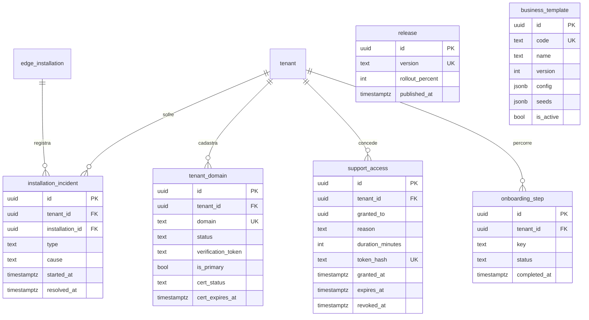

# 14 — Plataforma em escala

| | |
|---|---|
| **Ordem de execução** | 14 (após seeds — migration `AddPlatformScaleEpic` + `AddBusinessTemplateSeeds`) |
| **Depende de** | `01-Plataforma-e-Identidade.md`, `12-Seeds-e-Dados-Iniciais.md` |
| **ADRs** | [004](../ADRs/ADR-004-postgresql-rls-multitenancy.md), [010](../ADRs/ADR-010-dominio-proprio-white-label.md), [013](../ADRs/ADR-013-proibicao-de-codigo-por-cliente.md), [019](../ADRs/ADR-019-atualizacao-do-parque-edge.md), [029](../ADRs/ADR-029-branching-versionamento-release.md) |
| **Épico** | [E-14 · Plataforma em Escala](../user%20stories/E-14-Plataforma-em-Escala/README.md) |

---

## ERD



> `release` e `business_template` são catálogo de plataforma — sem `tenant_id`, sem RLS (mesma natureza de `tenant`: dado da Replay, não de um estabelecimento). As demais quatro tabelas são de negócio, com `tenant_id` e RLS `tenant_isolation` padrão.

---

## DDL

### installation_incident (US-140)

```sql
CREATE TABLE installation_incident (
  id               UUID PRIMARY KEY,
  tenant_id        UUID NOT NULL,
  installation_id  UUID NOT NULL REFERENCES edge_installation(id) ON DELETE CASCADE,
  type             VARCHAR(20) NOT NULL,   -- 'Offline' | 'Degraded'
  cause            TEXT,
  started_at       TIMESTAMPTZ NOT NULL,
  resolved_at      TIMESTAMPTZ,
  created_at       TIMESTAMPTZ NOT NULL DEFAULT now(),
  updated_at       TIMESTAMPTZ NOT NULL DEFAULT now()
);

CREATE INDEX idx_installation_incident_installation ON installation_incident (tenant_id, installation_id);
CREATE INDEX idx_installation_incident_open ON installation_incident (installation_id, resolved_at)
  WHERE resolved_at IS NULL;

ALTER TABLE installation_incident ENABLE ROW LEVEL SECURITY;
ALTER TABLE installation_incident FORCE ROW LEVEL SECURITY;
CREATE POLICY tenant_isolation ON installation_incident
  USING (tenant_id = current_tenant_id()) WITH CHECK (tenant_id = current_tenant_id());
```

Aberta/fechada por `InstallationHealthEvaluationWorker` (Api.Cloud) — classificação de saúde (OK/DEGRADED/DOWN) é computada pela nuvem a partir da defasagem de `edge_installation.last_seen_at`, nunca do auto-relato do edge (US-140 §9).

### tenant_domain (US-143)

```sql
CREATE TABLE tenant_domain (
  id                  UUID PRIMARY KEY,
  tenant_id           UUID NOT NULL REFERENCES tenant(id) ON DELETE CASCADE,
  domain              VARCHAR(253) NOT NULL,
  status              VARCHAR(24) NOT NULL,   -- 'PendingVerification' | 'Active'
  verification_token  TEXT NOT NULL,
  is_primary          BOOLEAN NOT NULL DEFAULT false,
  verified_at         TIMESTAMPTZ,
  cert_status         VARCHAR(16) NOT NULL,   -- 'None' | 'Issued' | 'Failed'
  cert_issued_at      TIMESTAMPTZ,
  cert_expires_at     TIMESTAMPTZ,
  created_at          TIMESTAMPTZ NOT NULL DEFAULT now(),
  updated_at          TIMESTAMPTZ NOT NULL DEFAULT now(),
  deleted_at          TIMESTAMPTZ,

  CONSTRAINT uq_tenant_domain_domain UNIQUE (domain)   -- RN-015: um domínio resolve exatamente um tenant
);

CREATE INDEX idx_tenant_domain_tenant ON tenant_domain (tenant_id);
CREATE INDEX idx_tenant_domain_cert_expires ON tenant_domain (cert_expires_at) WHERE cert_expires_at IS NOT NULL;

ALTER TABLE tenant_domain ENABLE ROW LEVEL SECURITY;
ALTER TABLE tenant_domain FORCE ROW LEVEL SECURITY;
CREATE POLICY tenant_isolation ON tenant_domain
  USING (tenant_id = current_tenant_id()) WITH CHECK (tenant_id = current_tenant_id());
```

Quando um domínio se torna o primário verificado de um tenant, `VerifyTenantDomainCommandHandler` espelha o valor em `tenant.domain` (`Tenant.SetCustomDomain`) — os resolvedores públicos de host (`GetPublicBrandingQueryHandler` e afins) continuam lendo só `tenant.domain` (a única tabela sem RLS), porque rodam `[AllowAnonymous]` antes de qualquer tenant ser conhecido e `tenant_domain` nega leitura sem `app.tenant_id` (ADR-004, falha fechada). Domínios secundários verificados ficam registrados aqui, mas não resolvem tráfego público até um mecanismo de cache futuro.

### support_access (US-145, estende US-090)

```sql
CREATE TABLE support_access (
  id               UUID PRIMARY KEY,
  tenant_id        UUID NOT NULL REFERENCES tenant(id) ON DELETE CASCADE,
  granted_to       UUID,
  reason           TEXT NOT NULL,
  duration_minutes INT NOT NULL,
  token_hash       TEXT NOT NULL,
  granted_at       TIMESTAMPTZ NOT NULL,
  expires_at       TIMESTAMPTZ NOT NULL,
  revoked_at       TIMESTAMPTZ,
  revoked_by       UUID,
  last_used_at     TIMESTAMPTZ,
  created_at       TIMESTAMPTZ NOT NULL DEFAULT now(),
  updated_at       TIMESTAMPTZ NOT NULL DEFAULT now(),

  CONSTRAINT uq_support_access_token_hash UNIQUE (token_hash)
);

CREATE INDEX idx_support_access_tenant ON support_access (tenant_id);
CREATE INDEX idx_support_access_active ON support_access (tenant_id, expires_at) WHERE revoked_at IS NULL;

ALTER TABLE support_access ENABLE ROW LEVEL SECURITY;
ALTER TABLE support_access FORCE ROW LEVEL SECURITY;
CREATE POLICY tenant_isolation ON support_access
  USING (tenant_id = current_tenant_id()) WITH CHECK (tenant_id = current_tenant_id());
```

Complementa (não substitui) o registro em `audit_log`/EVT-074 `support.access.granted` já emitido por `RecordSupportAccessCommand` (E-09/US-090) — aqui vive o CICLO DE VIDA do acesso (expiração, revogação), ausente naquele comando original.

### onboarding_step (US-141)

```sql
CREATE TABLE onboarding_step (
  id            UUID PRIMARY KEY,
  tenant_id     UUID NOT NULL REFERENCES tenant(id) ON DELETE CASCADE,
  key           VARCHAR(24) NOT NULL,   -- TenantCreated | Branding | Menu | Tables | EdgeInstall
                                          -- | PaymentConfig | Training | Pilot | Activation
  status        VARCHAR(16) NOT NULL,   -- Pending | InProgress | Done
  completed_at  TIMESTAMPTZ,
  completed_by  UUID,
  created_at    TIMESTAMPTZ NOT NULL DEFAULT now(),
  updated_at    TIMESTAMPTZ NOT NULL DEFAULT now(),

  CONSTRAINT uq_onboarding_step_tenant_key UNIQUE (tenant_id, key)
);

ALTER TABLE onboarding_step ENABLE ROW LEVEL SECURITY;
ALTER TABLE onboarding_step FORCE ROW LEVEL SECURITY;
CREATE POLICY tenant_isolation ON onboarding_step
  USING (tenant_id = current_tenant_id()) WITH CHECK (tenant_id = current_tenant_id());
```

Semeada por inteiro (nove linhas, `TENANT_CREATED` já `DONE`) em `ProvisionTenantCommandHandler`, via `OnboardingStep.SeedAll`. O wire format HTTP (`GET .../onboarding`) usa as chaves em `SCREAMING_SNAKE_CASE` do contrato da US-141 §7 — tradução feita em `OnboardingStepKeyWireFormat` (Contracts), não no valor persistido da coluna `key`.

### release (US-146)

```sql
CREATE TABLE release (
  id               UUID PRIMARY KEY,
  version          VARCHAR(20) NOT NULL,
  rollout_percent  INT NOT NULL DEFAULT 0,
  notes            TEXT,
  published_at     TIMESTAMPTZ NOT NULL,
  published_by     UUID,
  created_at       TIMESTAMPTZ NOT NULL DEFAULT now(),
  updated_at       TIMESTAMPTZ NOT NULL DEFAULT now(),

  CONSTRAINT uq_release_version UNIQUE (version)
);
```

Sem `tenant_id`/RLS — catálogo de plataforma. `edge_installation` ganhou três colunas para acompanhar o ciclo de atualização (mesma migration):

```sql
ALTER TABLE edge_installation
  ADD COLUMN target_version     VARCHAR(20),
  ADD COLUMN last_update_at     TIMESTAMPTZ,
  ADD COLUMN last_update_status VARCHAR(20);   -- Deferred | InProgress | Succeeded | Failed | RolledBack
```

Elegibilidade de rollout é decidida por `Release.IsEligibleFor(installationId)` — bucket determinístico e estável (`hash(release.id, installation.id) % 100 < rolloutPercent`), nunca condicional por tenant (ADR-013).

### business_template (US-142)

```sql
CREATE TABLE business_template (
  id          UUID PRIMARY KEY,
  code        VARCHAR(32) NOT NULL,
  name        TEXT NOT NULL,
  version     INT NOT NULL DEFAULT 1,
  config      JSONB NOT NULL DEFAULT '{}'::jsonb,   -- mesma forma de tenant_config (branding/operation/thresholds/...)
  seeds       JSONB NOT NULL DEFAULT '{}'::jsonb,   -- roles/stations/expenseCategories/financialAccounts
  is_active   BOOLEAN NOT NULL DEFAULT true,
  created_at  TIMESTAMPTZ NOT NULL DEFAULT now(),
  updated_at  TIMESTAMPTZ NOT NULL DEFAULT now(),

  CONSTRAINT uq_business_template_code UNIQUE (code)
);
```

Sem `tenant_id`/RLS — substitui o catálogo estático `ProvisioningTemplates` (que só sabia `PIZZERIA` via `switch`) por dado editável pela Replay sem deploy. Seed inicial (migration `AddBusinessTemplateSeeds`) traz `PIZZERIA`, `HAMBURGUERIA`, `RESTAURANTE`, `LANCHONETE`, cada um com praças/limiares/módulos diferentes. `tenant_config` ganhou duas colunas para registrar o modelo aplicado na criação (nunca alterado retroativamente por uma edição posterior do modelo):

```sql
ALTER TABLE tenant_config
  ADD COLUMN template_code    VARCHAR(32),
  ADD COLUMN template_version INT;
```

`tenant` ganhou duas colunas para a medição de tempo de implantação (US-141):

```sql
ALTER TABLE tenant
  ADD COLUMN onboarding_started_at TIMESTAMPTZ,
  ADD COLUMN activated_at          TIMESTAMPTZ;
```

---

## Eventos novos introduzidos por este épico

| Evento | Emitido por | Quando |
|---|---|---|
| `installation.health_degraded` | `EvaluateInstallationHealthCommand` (US-140) | Instalação passa a DEGRADED |
| `installation.health_down` | idem | Instalação passa a DOWN |
| `installation.health_recovered` | idem | Instalação volta a OK |

`EVT-074 support.access.granted` (US-090) e `EVT-050 product.created`/`product.updated` (importação, US-144, `payload.source = "IMPORT"`) já existiam no catálogo e foram reaproveitados sem alteração de contrato — ver `docs/04-Catalogo-de-Eventos-e-Maquinas-de-Estado.md` para backfill dos três novos tipos acima.

---

## Estratégia de teste

Cobertura completa (unit/integration/api/arch/e2e) por história — ver seção 12 de cada US em `docs/user stories/E-14-Plataforma-em-Escala/`. Destaques de isolamento multi-tenant testados:

- `installation_incident`/`onboarding_step`: RLS padrão, sem particularidade.
- `tenant_domain`: unicidade GLOBAL do domínio (não por tenant) — testado em `TenantDomainIntegrationTests`.
- `support_access`: token de um tenant nunca valida para outro — testado em `SupportAccessLifecycleTests` (o teste mais crítico do épico, única exceção sancionada à RN-015).

---

*Docs/Domain/14 · Épico E-14 · Pacote 004_DonaBetinha · Replay Studio.*
