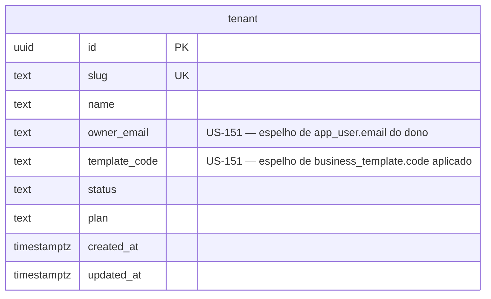

# 15 — Gestão geral da plataforma

| | |
|---|---|
| **Ordem de execução** | 15 (após plataforma em escala — migration `AddTenantDirectorySearchFields`) |
| **Depende de** | `01-Plataforma-e-Identidade.md`, `14-Plataforma-em-Escala.md` |
| **ADRs** | [004](../ADRs/ADR-004-postgresql-rls-multitenancy.md), [013](../ADRs/ADR-013-proibicao-de-codigo-por-cliente.md), [021](../ADRs/ADR-021-tratamento-de-erros.md), [023](../ADRs/ADR-023-modelo-de-autorizacao.md) |
| **Épico** | [E-15 · Gestão Geral da Plataforma](../user%20stories/E-15-Gestao-Geral-da-Plataforma/README.md) |

---

## ERD



> Nenhuma tabela nova — esta história é **aditiva** sobre `tenant` (a única tabela sem `tenant_id`/RLS), mesmo padrão de `14-Plataforma-em-Escala.md` §`business_template`/`onboarding_step` alterando `tenant`/`tenant_config` em vez de criar tabela própria.

---

## DDL

### tenant — colunas novas (US-151)

```sql
ALTER TABLE tenant
  ADD COLUMN owner_email    VARCHAR(255),
  ADD COLUMN template_code  VARCHAR(32);

CREATE INDEX idx_tenant_created_at ON tenant (created_at);
CREATE INDEX idx_tenant_status ON tenant (status);
CREATE INDEX idx_tenant_template_code ON tenant (template_code);

-- Índices de EXPRESSÃO (lower(...)) para ILIKE case-insensitive — sem suporte nativo na Fluent API
-- do EF Core, por isso via SQL cru na migration (não `HasIndex` do ORM).
CREATE INDEX idx_tenant_name ON tenant (lower(name));
CREATE INDEX idx_tenant_owner_email ON tenant (lower(owner_email));
```

### Por que denormalizar em vez de consultar `app_user`/`tenant_config` diretamente

O diretório de estabelecimentos (US-151, exclusivo do papel P9 "administrador da plataforma") precisa buscar/filtrar por e-mail do proprietário e por modelo de negócio **cruzando todos os tenants ao mesmo tempo** — mas:

- `app_user` (onde vive o e-mail real, via `user_role` com papel `OWNER`) tem RLS (ADR-004): sem `app.tenant_id` fixado no contexto, a política `tenant_isolation` nega leitura por padrão ("falha fechada"), e o diretório roda exatamente ANTES de saber a qual tenant uma linha pertence.
- `tenant_config.template_code` (US-142, `14-Plataforma-em-Escala.md`) tem o mesmo problema — é `tenant_config`, não `tenant`, e `tenant_config` tem RLS.

Três caminhos foram cogitados (US-151 §8/§15, "medir antes de escolher"):

1. **Papel `platform_admin` (BYPASSRLS)** — existe desde a migration `EnableRowLevelSecurity`, mas nenhuma conexão da aplicação o usa até hoje; adotá-lo é decisão de arquitetura maior, fora do escopo desta história (mesma nota já registrada em `EmailOutboxDeliveryWorker`).
2. **View materializada de diretório** — cogitada em US-151 §8 ("View de diretório | Agregação otimizada"), mas a própria história deixa a escolha em aberto até medir volume real.
3. **Denormalização em `tenant`** (escolhida) — mesmo padrão já usado para `Plan` desde a US-002: o dado de negócio continua tendo dono em outro lugar (`app_user`/`business_template`), só um ESPELHO de leitura rápida vive na raiz global. Mais barato que as outras duas opções e consistente com o precedente do próprio schema.

`owner_email`/`template_code` são escritos por `ProvisionTenantCommandHandler` (`Tenant.SetOwnerEmail`/`Tenant.SetTemplateCode`) no momento do provisionamento, a partir do e-mail do proprietário e do `business_template.code` já resolvidos nesse handler — nunca atualizados retroativamente por uma troca de dono ou reconfiguração posterior (mesma ressalva já feita para `tenant_config.template_code` em `14-Plataforma-em-Escala.md`).

### Contagens e saúde por linha do diretório

`storesCount`/`installationsCount`/`health` (contrato de `GET /v1/platform/tenants`) **não são colunas** — são agregados de `store`/`edge_installation` (ambas com RLS), calculados por `ListTenantsQueryHandler` só para os tenants da PÁGINA atual (após busca/filtro/ordenação/cursor já aplicados só em `tenant`), fixando `app.tenant_id` por tenant como `GetPlatformSummaryQueryHandler` (US-150) já fazia — nunca para a base inteira. `health` reusa `InstallationHealthClassifier` (US-140) por instalação e agrega o PIOR status entre as instalações com `installed_at IS NOT NULL`; tenant sem nenhuma instalação instalada é `UNKNOWN` (nunca `DOWN` — não há evidência de queda, só ausência de instalação).

---

## US-152 — Visão 360 e acesso aos módulos do estabelecimento

`GET /v1/platform/tenants/{id}/overview` — mesma regra de US-151: **nenhuma tabela nova**, agregado de leitura só sobre entidades que já existem (`tenant`, `store`, `edge_installation`, `app_user`/`user_role`/`role` para o dono, `owner_invite`, `onboarding_step` da US-141). Exclusivo da policy `PlatformAdmin` (diferente de `GetTenantByIdQueryHandler`/`OnboardingController`, que também servem o autoatendimento do próprio tenant — aqui não há equivalente self-service, US-152 §1 "como administrador da plataforma").

- **Dono**: resolvido via `user_role` → `role.code = 'OWNER'` → `app_user` (RLS exige `SET LOCAL app.tenant_id` antes, mesmo padrão de `ListTenantsQueryHandler.BuildRowsAsync`/`ProvisionTenantCommandHandler`). `inviteStatus` deriva do `owner_invite` mais recente do mesmo usuário: `ACCEPTED` (`consumed_at` preenchido), `EXPIRED` (`expires_at` no passado e não consumido) ou `PENDING`. Tenant sem dono resolvido devolve `owner: null` — a agregação continua (resiliência de seção, US-152 §12), nunca 500.
- **Checklist de implantação**: reusa os nove `onboarding_step` semeados por `OnboardingStep.SeedAll` (US-141) — nunca recalcula em memória feito o catálogo estático `ProvisioningChecklist` (esse serve só a resposta imediata do provisionamento). `deployment.total` é sempre `Enum.GetValues<OnboardingStepKey>().Length` (9), não a contagem de linhas persistidas — protege tenants antigos com menos linhas semeadas. `nextAction` é a chave (`OnboardingStepKeyWireFormat`) do primeiro passo, na ORDEM do enum, cujo status não é `Done`; nulo quando `completed == total`.
- **Instalações**: `status` deriva de `EdgeInstallation.IsInstalled`/`Connectivity` (`PENDING` sem instalação concluída, `OFFLINE` quando `Connectivity == Offline`, `ACTIVE` caso contrário) — não é coluna. `health` reusa `InstallationHealthClassifier` por instalação instalada; instalação `PENDING` é sempre `UNKNOWN` (mesma regra de "nunca reportar DOWN por ausência de evidência" de `TenantHealthClassifier`, US-151).
- **Links**: `publicMenu`/`admin` resolvidos a partir do MESMO `PlatformDomainOptions.DefaultDomainSuffix` que `TenantDomainRedirectResolver` (US-143) já usa — `tenant.Domain` (customizado, verificado) se presente, senão `"{slug}.{DefaultDomainSuffix}"` se o sufixo estiver configurado; nulo nos dois casos ausentes. `links.health` permanece deliberadamente nulo (mesma PENDÊNCIA de "URLs por ambiente" — o front usa navegação interna para o painel de Instalações da US-140 em vez de um link externo).

### Estratégia de teste (US-152)

- `GetTenantOverviewQueryHandlerTests` (unitário/integração): cadastro saudável, provisionamento incompleto (instalação pendente + `nextAction` preenchido), dono ausente não derruba a resposta, tenant inexistente/soft-deletado → 404 sem detalhe adicional.
- `TenantsController` (API/autorização): 403 sem `PlatformAdmin`, 404 para id inexistente — nunca 403 por vazamento de existência (ADR-021).
- Contrato: `packages/contracts/src/tenant-overview.ts` ↔ `Nexora.Contracts.Tenants.TenantOverviewContracts` mantidos em sincronia manual (mesmo padrão dos demais contratos deste pacote).

---

## US-153 — Ciclo de vida do estabelecimento

Formaliza a máquina de estados canônica que já era mencionada, mas nunca implementada como tal, em
`14-Plataforma-em-Escala.md`/`15` anteriores: o enum interno do EF Core (`Tenant.Status`, mapeado
como `integer`, não como enum nativo do Postgres — ver nota em `AppUserConfiguration`) tinha
`TRIAL` como primeiro valor (0); `docs/domain/00-Convencoes-e-Tipos.md §"tenant_status"` documentava
`TRIAL|ACTIVE|SUSPENDED|CANCELLED`, mas o contrato operacional (`ProvisionTenantCommandHandler`) já
respondia o literal `"PROVISIONED"` — divergência que esta história fecha.

### Mudança de enum (sem migração de dado no caso comum)

```csharp
public enum TenantStatus { Provisioned, Active, Suspended, Cancelled, Installing }
```

`Trial` foi RENOMEADO para `Provisioned` (mesmo valor `0` já persistido — renomear um rótulo de
enum mapeado como `integer` é recompilação, não migração) e `Installing` foi ACRESCENTADO NO FINAL
(valor `4`), mesma convenção já usada em `UserStatus.Invited`: inserir no meio deslocaria
`Active`/`Suspended`/`Cancelled` (1/2/3) já persistidos.

### DDL — migration `AddTenantStatusLifecycle`

```sql
ALTER TABLE tenant ADD COLUMN status_version INTEGER NOT NULL DEFAULT 1;

CREATE TABLE tenant_status_history (
  id               UUID PRIMARY KEY,
  tenant_id        UUID NOT NULL REFERENCES tenant(id) ON DELETE CASCADE,
  previous_status  INTEGER NOT NULL,
  new_status       INTEGER NOT NULL,
  reason           TEXT NOT NULL,
  actor_id         UUID,
  origin           VARCHAR(32) NOT NULL,   -- 'PLATFORM_ADMIN' | 'SYSTEM'
  domain_event_id  UUID,                   -- correlação com tenant.status_changed (EVT-056)
  effective_at     TIMESTAMPTZ NOT NULL,
  created_at       TIMESTAMPTZ NOT NULL
);
CREATE INDEX idx_tenant_status_history_tenant ON tenant_status_history (tenant_id, created_at);

-- RLS (ADR-004), mesmo padrão da migration AddPlatformScaleEpic para tabela nova com tenant_id:
ALTER TABLE tenant_status_history ENABLE ROW LEVEL SECURITY;
ALTER TABLE tenant_status_history FORCE ROW LEVEL SECURITY;
CREATE POLICY tenant_isolation ON tenant_status_history
  USING (tenant_id = current_tenant_id()) WITH CHECK (tenant_id = current_tenant_id());

-- Migração de estados legados: tenant PROVISIONED (0) com pelo menos uma instalação edge já
-- concluída (o mesmo sinal técnico agora usado por RegisterInstallationCommandHandler) avança para
-- INSTALLING (4); quem nunca teve instalação concluída permanece PROVISIONED.
UPDATE tenant SET status = 4, status_version = status_version + 1, updated_at = now()
WHERE status = 0 AND EXISTS (
  SELECT 1 FROM edge_installation
  WHERE edge_installation.tenant_id = tenant.id AND edge_installation.installed_at IS NOT NULL
);
```

### Máquina de estados (`Nexora.Domain.Platform.TenantStatusTransitions`)

Único ponto de verdade — usado por `Tenant.TransitionStatus` (Domain, lança `DomainException` em
transição inválida) e pela Application (pré-checagem que devolve 409
`TENANT_STATUS_TRANSITION_INVALID` em vez de deixar a exceção virar 500):

| De | Para |
|---|---|
| PROVISIONED | INSTALLING, CANCELLED |
| INSTALLING | ACTIVE, CANCELLED |
| ACTIVE | SUSPENDED, CANCELLED |
| SUSPENDED | ACTIVE, CANCELLED |
| CANCELLED | *(nenhuma — terminal)* |

`TenantStatusTransitions.AdminTargetsFrom(from)` é o mesmo conjunto MENOS `INSTALLING` (essa
transição só o registro técnico da instalação edge decide, nunca o administrador) — alimenta tanto
a validação de `POST /v1/platform/tenants/{id}/status-transitions` quanto
`TenantOverviewResponse.tenant.availableTransitions` (doc §10 da US "próxima transição permitida").

### As três origens que emitem `tenant.status_changed` (EVT-056)

1. **`RegisterInstallationCommandHandler`** (Cloud) — PROVISIONED→INSTALLING, ao completar o
   registro da primeira instalação edge de um tenant recém-provisionado (`origin: "SYSTEM"`).
2. **`ActivateTenantCommandHandler`** (US-141) — INSTALLING→ACTIVE quando os oito passos do
   checklist estão concluídos; se o tenant ainda estiver PROVISIONED neste ponto (ex.: instalação
   marcada fora do protocolo de token), o handler primeiro registra PROVISIONED→INSTALLING antes de
   ACTIVE, preservando o histórico completo (`origin: "SYSTEM"`).
3. **`TransitionTenantStatusCommandHandler`** — `POST .../status-transitions`, exclusivo de
   `PlatformAdmin` (`origin: "PLATFORM_ADMIN"`): ACTIVE⇄SUSPENDED e `*`→CANCELLED, com motivo
   obrigatório (422 `REASON_REQUIRED`) e concorrência otimista via `If-Match`/`status_version` (409
   `CONCURRENCY_CONFLICT` quando desatualizado). Grava `tenant_status_history` + `audit_log` +
   `domain_event` na MESMA transação (`TransactionBehavior`, ADR-006).

`Idempotency-Key` (ADR-020) é tratado genericamente pelo `IdempotencyMiddleware` — reenviar a mesma
chave devolve a resposta original sem invocar o handler de novo; nenhuma lógica extra de
deduplicação foi necessária neste comando.

### Estratégia de teste (US-153)

- `TenantStatusTransitionsTests`/`TenantTests` (unitário, sem banco): matriz completa de transições
  válidas/inválidas, `AdminTargetsFrom` nunca inclui INSTALLING, `ActivatedAt` só grava na primeira
  ativação (reativação não sobrescreve).
- `TransitionTenantStatusIntegrationTests` (Testcontainers.PostgreSql real): suspensão grava
  histórico/evento/audit_log, reativação sucede, `CANCELLED→ACTIVE` recusa com 409 sem persistir
  nada, versão divergente no `If-Match` retorna 409 de concorrência sem persistir, motivo vazio
  retorna 422.
- `TenantStatusTransitionResultMappingTests` (API): policy `PlatformAdmin` no método do controller,
  tradução dos três códigos de erro específicos para os status HTTP do contrato.
- `OnboardingIntegrationTests` (US-141, reexecutado sem alteração de asserts) continua verde: o
  caminho INSTALLING→ACTIVE de `ActivateTenantCommandHandler` não muda o contrato observável dessa
  história, só passa a emitir o evento/histórico que faltava.

---

## Estratégia de teste (US-151)

Ver US-151 §12. Destaques de isolamento/normalização testados:

- `TenantDirectoryIntegrationTests` (Testcontainers.PostgreSql real): busca combinada nome+status, busca por e-mail do proprietário, paginação por cursor estável para os quatro critérios de ordenação (com atenção especial a `sort=name`, o único que compara string via `CompareTo` em vez de data/enum), filtro por saúde agregada, filtro por modelo de negócio, normalização de status/saúde em caixa alta.
- `ProvisionTenantIntegrationTests`: confirma que `owner_email`/`template_code` são gravados no provisionamento.
- `TenantAttentionRankingTests`/`TenantDirectorySupportTests`/`TenantDirectoryCursorTests` (unitário, sem banco): ranking de criticidade, rótulos de wire format, encode/decode do cursor opaco.

---

*Docs/Domain/15 · Épico E-15 · Pacote 004_DonaBetinha · Replay Studio.*
