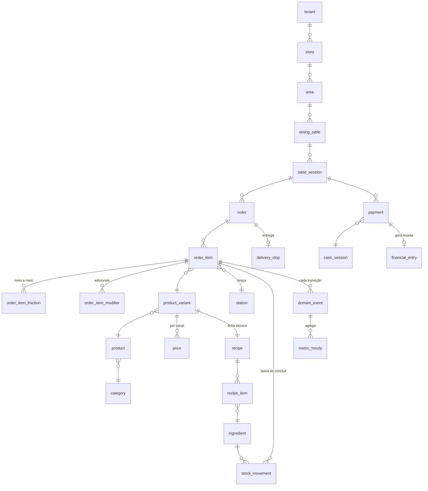

# ERD Consolidado
## Ecossistema Nexora

| | |
|---|---|
| **Versão** | 1.0 |
| **Data** | 31/07/2026 |
| **Detalhamento** | Documentos 01 a 09 desta pasta |

---

## 1. Mapa de contextos

```
┌───────────────────────────────────────────────────────────────────────┐
│  PLATAFORMA (doc. 01)                                                 │
│  tenant · tenant_config · store · edge_installation                   │
│  app_user · role · user_role · device · audit_log · tenant_secret     │
└──────────────────────────────┬────────────────────────────────────────┘
                               │ tenant_id em tudo (RLS)
        ┌──────────────────────┼──────────────────────┐
        ▼                      ▼                      ▼
┌───────────────┐     ┌─────────────────┐    ┌──────────────────┐
│ CATÁLOGO      │────►│ OPERAÇÃO        │───►│ CAIXA            │
│ (doc. 02)     │     │ (doc. 03)       │    │ (doc. 04)        │
│ category      │     │ area            │    │ cash_session     │
│ product       │     │ dining_table    │    │ cash_movement    │
│ variant       │     │ table_session   │    │ payment          │
│ price         │     │ order           │    │ payment_alloc    │
│ modifier      │     │ order_item      │    └────────┬─────────┘
│ station       │     │ item_fraction   │             │
│ media_asset   │     │ item_modifier   │             │
└───────┬───────┘     └────────┬────────┘             │
        │                      │                      │
        ▼                      ▼                      ▼
┌───────────────┐     ┌─────────────────┐    ┌──────────────────┐
│ ESTOQUE       │     │ DELIVERY        │    │ FINANCEIRO       │
│ (doc. 05)     │     │ (doc. 06)       │    │ (doc. 07)        │
│ ingredient    │     │ customer        │    │ fin_account      │
│ recipe        │     │ address         │    │ expense_category │
│ recipe_item   │     │ delivery_zone   │    │ financial_entry  │
│ stock_movement│     │ courier         │    │ employee         │
│ purchase      │     │ delivery_run    │    │ payroll          │
│ inventory_cnt │     │ delivery_stop   │    │ payroll_item     │
└───────┬───────┘     └────────┬────────┘    └────────┬─────────┘
        │                      │                      │
        └──────────────────────┼──────────────────────┘
                               ▼
        ┌──────────────────────────────────────────────┐
        │  EVENTOS (doc. 08)                           │
        │  domain_event (particionada) · outbox        │
        │  sync_cursor · sync_conflict · idempotency   │
        └──────────────────┬───────────────────────────┘
                           ▼
        ┌──────────────────────────────────────────────┐
        │  MÉTRICAS (doc. 09) — cache descartável      │
        │  metric_hourly · metric_daily                │
        │  metric_product_daily · metric_operator_daily│
        │  goal · alert                                │
        └──────────────────────────────────────────────┘
```

---

## 2. ERD central — do pedido ao pagamento



---

## 3. O caminho de um pedido

O trajeto completo, com as tabelas que participam de cada etapa:

```
1. Cliente lê o QR Code
   dining_table.qr_token → table_session (OPEN)
   evento: table.session.opened

2. Monta e confirma o pedido
   order (PLACED) + order_item (QUEUED)
   + order_item_fraction (se meio a meio)
   + order_item_modifier
   preço: price (canal DINE_IN) + modifier.price_delta
   evento: order.placed  →  T0 gravado

3. Roteamento
   order_item.station_id ← product.station_id
   WebSocket emite para station:{id}, role:cashier, table:{id}

4. Cozinha inicia
   order_item (FIRED), fired_at = T1
   evento: order.item.fired

5. Entra no forno
   order_item (IN_OVEN), oven_in_at = T2, oven_slot ocupado
   evento: order.item.oven_in

6. Sai do forno e fica pronto
   order_item (READY), oven_out_at = T3, ready_at = T4
   evento: order.item.ready
   ► BAIXA DE ESTOQUE: stock_movement (PRODUCTION, negativo)
     via recipe_item, proporcional a order_item_fraction.weight
   ► unit_cost gravado em order_item

7. Garçom entrega
   order_item (SERVED), served_at = T5
   evento: order.item.served

8. Cliente pede a conta
   table_session (BILL_REQUESTED)
   evento: table.bill_requested

9. Caixa recebe
   payment + payment_allocation
   table_session (PAID → CLOSED)
   evento: payment.registered
   ► financial_entry (REVENUE) criado automaticamente

10. Mesa liberada
    dining_table (FREE), table_session.released_at
    evento: table.released

11. Agregação (worker, a cada 30 s)
    metric_hourly ← domain_event
    metric_daily, metric_product_daily, metric_operator_daily

12. Sincronização (a cada 2 s)
    outbox → nuvem → domain_event (recorded_at atribuído)
```

---

## 4. Onde nasce cada indicador

| Indicador | Origem |
|---|---|
| Tempo de fila | `order_item.fired_at − placed_at` |
| Tempo de produção | `order_item.ready_at − fired_at` |
| Tempo de cocção | `order_item.oven_out_at − oven_in_at` |
| **Tempo total** | `order_item.served_at − placed_at` |
| Aderência ao prazo | `order.served_at <= promised_at` |
| Ocupação do gargalo | `count(order_item WHERE status='IN_OVEN') ÷ station.capacity_slots` |
| Ociosidade com fila | `metric_hourly.oven_idle_with_queue_seconds` |
| Ticket médio | `metric_daily.revenue ÷ orders` |
| Giro de mesa | `metric_daily.sessions ÷ count(dining_table)` |
| **Custo por produto** | `variant_cost(variant_id)` — recursivo sobre `recipe_item` |
| **Margem** | `price.amount − variant_cost()` |
| **CMV teórico** | `Σ order_item.unit_cost × quantity` |
| **CMV real** | `estoque inicial + compras − estoque final` (via `inventory_count`) |
| Divergência de CMV | real − teórico |
| Perda por motivo | `stock_movement WHERE type='WASTE'` agrupado por `waste_reason` |
| Prime cost | `(CMV + folha) ÷ receita` |
| Ponto de equilíbrio | `custo fixo ÷ margem de contribuição %` |

---

## 5. Contagem de objetos

| Tipo | Quantidade |
|---|---|
| Tabelas de negócio | 52 |
| Tabelas globais | 2 (`tenant`, `unit_of_measure`) |
| Tabelas de infraestrutura | 5 (evento, outbox, cursor, conflito, idempotência) |
| Enums | 23 |
| Domínios de tipo | 6 |
| Views | 6 |
| Funções | 7 |
| Triggers | ~35 |
| Índices | ~80 |
| Políticas RLS | 53 |

---

## 6. Tabelas por fase de implementação

| Fase | Tabelas |
|---|---|
| **0 — Fundação** | `tenant`, `tenant_config`, `store`, `edge_installation`, `app_user`, `role`, `user_role`, `device`, `audit_log`, `tenant_secret`, `idempotency_key` |
| **1 — MVP** | `station`, `category`, `product`, `product_variant`, `price`, `modifier*`, `media_asset`, `area`, `dining_table`, `table_session`, `order`, `order_item`, `order_item_fraction`, `order_item_modifier`, `cash_session`, `cash_movement`, `payment`, `payment_allocation`, `domain_event`, `outbox`, `sync_cursor`, `sync_conflict`, `metric_hourly`, `metric_daily`, `alert` |
| **2 — Custo** | `unit_of_measure`, `supplier`, `ingredient`, `recipe`, `recipe_item`, `stock_movement`, `purchase`, `purchase_item`, `inventory_count`, `inventory_count_item`, `metric_product_daily`, `goal` |
| **3 — Financeiro** | `financial_account`, `expense_category`, `financial_entry`, `employee`, `payroll`, `payroll_item`, `metric_operator_daily` |
| **4 — Delivery** | `customer`, `customer_address`, `delivery_zone`, `courier`, `delivery_run`, `delivery_stop` |

> As tabelas das fases 2 a 4 são **criadas já na Fase 1**, vazias. Criar tabela vazia custa nada; adicionar coluna em tabela com milhões de linhas depois custa janela de manutenção no parque inteiro (ADR-019).

---

## 7. Decisões de modelagem que merecem atenção

| # | Decisão | Por quê |
|---|---|---|
| 1 | `order_item_fraction` em vez de dois campos de sabor | Suporta 2, 3 ou 4 sabores sem mudar o schema; e a baixa de estoque fica proporcional ao peso |
| 2 | `stock_movement` como verdade, `current_stock` materializado | Elimina o único conflito real de sincronização (ADR-008) |
| 3 | `price` historicizado com `valid_from`/`valid_to` | Permite recalcular a margem de um pedido antigo com o preço da época |
| 4 | `business_day` materializado em toda tabela agregável | Consulta por período não pode depender de função em tempo de execução (ADR-018) |
| 5 | Seis carimbos em `order_item` | Cada intervalo é um diagnóstico diferente — média única esconde o gargalo |
| 6 | `domain_event` particionada por `occurred_at`, não `recorded_at` | Evento sincronizado com atraso pertence ao mês em que ocorreu (ADR-035) |
| 7 | `name_snapshot` em `order_item_modifier` | Comprovante antigo continua correto após renomeação |
| 8 | `fraction_quantity` em `metric_product_daily` | Contar meio a meio como unidade inteira distorce a curva ABC |
| 9 | `size_code` e `fraction_group` | Impedem combinar meia pizza com meio hambúrguer |
| 10 | `net_amount` gerado em `payment` | A taxa de cartão é despesa que costuma ser invisível ao dono |
| 11 | `is_cmv` em `expense_category` | Separa o que entra no CMV do que é despesa operacional |
| 12 | `ck_item_sequence` em `order_item` | Impede estruturalmente duração negativa, que corromperia todo indicador |

---

*Replay Studio — Projeto 004_DonaBetinha.*
